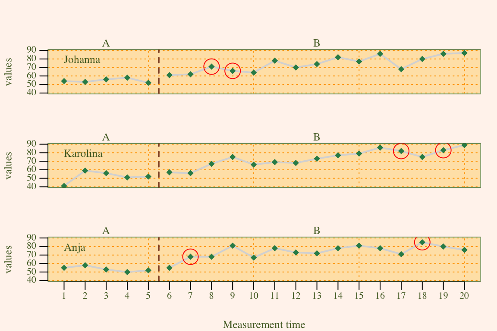
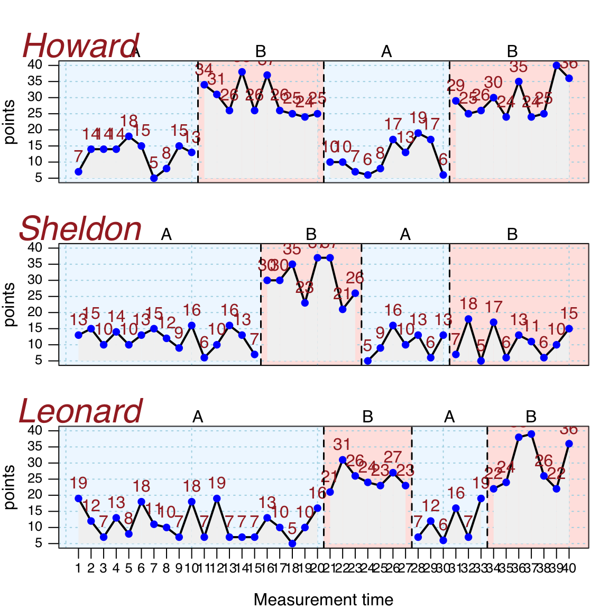

# Creating a single-case data plot


```{=html}
<table>
 <tr>
  <td width="75px" style="background-color:#EEEEEE"></td> 
  <td style="background-color:#EEEEEE"><font face="Courier New" size="2"> plotSC(data, dvar, pvar, mvar, ylim = NULL, xlim = NULL, xinc = 1, lines = NULL, marks = NULL, phase.names = NULL, xlab = NULL, ylab = NULL, main = "", case.names = NULL, style = getOption("scan.plot.style"), ...) </font></td>
 </tr>
</table>  
``` 

Plotting the data is a first important approach of analyzing. After you build an *scdf* the `plot` command helps to visualize the data. When the `scdf` includes more than one case a multiple baseline figure is provided. Various arguments can be set to customize the appearance of the plot. Table \@ref(tab:table-plot-arguments) gives an overview of all available arguments.  
Labels of the axes and for the phases can be changed with the `xlab`, `ylab`, and the `phase.names` arguments. The x- and y-scaling of the graphs are by default calculated as the minimum and the maximum of all included single cases. The `xlim` and the `ylim` argument are used to set specific values. The argument takes a vector of two numbers. The first for the lower and the second for the upper limit of the scale. In case of multiple single cases an `NA` sets the individual minimum or maximum for each case. Assume for example the study contains three single cases `ylim = c(0, NA)` will set the lower limit for all three single cases to `0` and the upper limit individually at the maximum of each case.

<table class="table table" style="width: auto !important; margin-left: auto; margin-right: auto; margin-left: auto; margin-right: auto;">
<caption>(\#tab:table-plot-arguments)Arguments of the plot function</caption>
 <thead>
  <tr>
   <th style="text-align:left;"> Argument </th>
   <th style="text-align:left;"> What it does ... </th>
  </tr>
 </thead>
<tbody>
  <tr>
   <td style="text-align:left;font-weight: bold;width: 15em; "> data </td>
   <td style="text-align:left;width: 30em; "> A single-case data frame. </td>
  </tr>
  <tr>
   <td style="text-align:left;font-weight: bold;width: 15em; "> ylim </td>
   <td style="text-align:left;width: 30em; "> Lower and upper limits of the y-axis </td>
  </tr>
  <tr>
   <td style="text-align:left;font-weight: bold;width: 15em; "> xlim </td>
   <td style="text-align:left;width: 30em; "> Lower and upper limits of the x-axis. </td>
  </tr>
  <tr>
   <td style="text-align:left;font-weight: bold;width: 15em; "> style </td>
   <td style="text-align:left;width: 30em; "> A specific design for displaying the plot. </td>
  </tr>
  <tr>
   <td style="text-align:left;font-weight: bold;width: 15em; "> lines </td>
   <td style="text-align:left;width: 30em; "> A character or list defining one or more lines or curves to be plotted. </td>
  </tr>
  <tr>
   <td style="text-align:left;font-weight: bold;width: 15em; "> marks </td>
   <td style="text-align:left;width: 30em; "> A list of parameters defining markings of certain data points. </td>
  </tr>
  <tr>
   <td style="text-align:left;font-weight: bold;width: 15em; "> main </td>
   <td style="text-align:left;width: 30em; "> A figure title </td>
  </tr>
  <tr>
   <td style="text-align:left;font-weight: bold;width: 15em; "> phase.names </td>
   <td style="text-align:left;width: 30em; "> By default phases are labeled as given in the phase variable. Use this argument to specify different labels: `phase.names = c('Baseline', 'Intervention')`. </td>
  </tr>
  <tr>
   <td style="text-align:left;font-weight: bold;width: 15em; "> case.names </td>
   <td style="text-align:left;width: 30em; "> Case names. If not provided, names are taken from the scdf or left blank if the scdf does not contain case names. </td>
  </tr>
  <tr>
   <td style="text-align:left;font-weight: bold;width: 15em; "> xlab </td>
   <td style="text-align:left;width: 30em; "> The label of the x-axis. The default is taken from the name of the measurement variable as provided by the scdf. </td>
  </tr>
  <tr>
   <td style="text-align:left;font-weight: bold;width: 15em; "> ylab </td>
   <td style="text-align:left;width: 30em; "> The labels of the y-axis. The default is taken from the name of the dependent variable as provided by the scdf. </td>
  </tr>
  <tr>
   <td style="text-align:left;font-weight: bold;width: 15em; "> xinc </td>
   <td style="text-align:left;width: 30em; "> An integer. Increment of the x-axis. 1 : each mt value will be printed, 2 : every other value, 3 : every third values etc. </td>
  </tr>
  <tr>
   <td style="text-align:left;font-weight: bold;width: 15em; "> ... </td>
   <td style="text-align:left;width: 30em; "> Further arguments passed to the generic plot command. </td>
  </tr>
</tbody>
</table>

Extra lines can be added to the plot using the `lines` argument. The lines argument takes several separate sub-arguments which have to be provided in a list. In its most simple form this list contains one element. `lines = list('median')` adds a line with the median of each phase to the plot. Additional arguments like `col` or `lwd` help to format these lines. For adding red thick median lines use the command `lines = list('median', col = 'red', lwd = '2')`.

<table class="table table" style="width: auto !important; margin-left: auto; margin-right: auto; margin-left: auto; margin-right: auto;">
<caption>(\#tab:table-lines-arguments)Values of the lines argument</caption>
 <thead>
  <tr>
   <th style="text-align:left;"> Argument </th>
   <th style="text-align:left;"> What it does ... </th>
  </tr>
 </thead>
<tbody>
  <tr>
   <td style="text-align:left;font-weight: bold;width: 15em; "> median </td>
   <td style="text-align:left;width: 30em; "> separate lines for the medians of each phase </td>
  </tr>
  <tr>
   <td style="text-align:left;font-weight: bold;width: 15em; "> mean </td>
   <td style="text-align:left;width: 30em; "> separate lines for the means of each phase. By default it is 10%-trimmed. Other trims can be set using a second parameter (e.g., `lines = list(mean = 0.2)` draws a 20%-trimmed mean line). </td>
  </tr>
  <tr>
   <td style="text-align:left;font-weight: bold;width: 15em; "> trend </td>
   <td style="text-align:left;width: 30em; "> Separate lines for the trend of each phase. </td>
  </tr>
  <tr>
   <td style="text-align:left;font-weight: bold;width: 15em; "> trendA </td>
   <td style="text-align:left;width: 30em; "> Trend line for phase A, extrapolated throughout the other phases </td>
  </tr>
  <tr>
   <td style="text-align:left;font-weight: bold;width: 15em; "> maxA </td>
   <td style="text-align:left;width: 30em; "> Line at the level of the highest phase A score. </td>
  </tr>
  <tr>
   <td style="text-align:left;font-weight: bold;width: 15em; "> minA </td>
   <td style="text-align:left;width: 30em; "> Line at the level of the lowest phase A score. </td>
  </tr>
  <tr>
   <td style="text-align:left;font-weight: bold;width: 15em; "> medianA </td>
   <td style="text-align:left;width: 30em; "> Line at the phase A median score. </td>
  </tr>
  <tr>
   <td style="text-align:left;font-weight: bold;width: 15em; "> meanA </td>
   <td style="text-align:left;width: 30em; "> Line at the phase A 10%-trimmed mean score. Apply a different trim, by using the additional argument (e.g., `lines = list(meanA = 0.2)`). </td>
  </tr>
  <tr>
   <td style="text-align:left;font-weight: bold;width: 15em; "> movingMean </td>
   <td style="text-align:left;width: 30em; "> Draws a moving mean curve, with a specified lag: `'lines = list(movingMean = 2)'`. Default is a lag 1 curve. </td>
  </tr>
  <tr>
   <td style="text-align:left;font-weight: bold;width: 15em; "> movingMedian </td>
   <td style="text-align:left;width: 30em; "> Draws a moving median curve, with a specified lag: `'lines = list(movingMedian = 3).` Default is a lag 1 curve. </td>
  </tr>
  <tr>
   <td style="text-align:left;font-weight: bold;width: 15em; "> loreg </td>
   <td style="text-align:left;width: 30em; "> Draws a non-parametric local regression line. The proportion of data influencing each data point can be specified using `lines = list('loreg' = 0.66)`. The default is 0.5. </td>
  </tr>
  <tr>
   <td style="text-align:left;font-weight: bold;width: 15em; "> lty </td>
   <td style="text-align:left;width: 30em; "> Line type. Examples are: 'solid','dashed', 'dotted'. </td>
  </tr>
  <tr>
   <td style="text-align:left;font-weight: bold;width: 15em; "> lwd </td>
   <td style="text-align:left;width: 30em; "> Line thickness, e.g., `lwd = 4`. </td>
  </tr>
  <tr>
   <td style="text-align:left;font-weight: bold;width: 15em; "> col </td>
   <td style="text-align:left;width: 30em; "> Line colour, e.g., `col = 'red'`. </td>
  </tr>
</tbody>
</table>

Specific data points can be highlighted using the `marks` argument. A `list` defines the measurement times to be marked, the marking color and the size of the marking. `marks = list(position = c(1,5,6))` marks the first, fifth, and sixth measurement time. If the _scdf_ contains more than one data-set marking would be the same for all data sets in this example. In case you define a `list` Containing vectors, marking can be individually defined for each data set. Assume, for example, we have an _scdf_ comprising three data sets, then `marks = list(position = list(c(1,2), c(3,4), c(5,6)))` will highlight measurement times one and two for the first data set, three and four for the second and five and six for the third. `pch`, `col` and `cex` define symbol, colour and size of the markings.


```r
# plot with marks in a red circles 2.5 times larger than the standard symbol 
# size. exampleAB is an example scdf included in the scan package
marks <- list(
  positions = list( c(8, 9), c(17, 19), c(7, 18) ), 
  col = 'red', cex = 2.5, pch = 1
)
plot(exampleAB, marks = marks, style = "sienna")
```

<div class="figure" style="text-align: center">

<p class="caption">(\#fig:marks_example)Example of a plot with highlighted data-points</p>
</div>

## Graphical styles of a plot


```{=html}
<table>
 <tr>
  <td width="75px" style="background-color:#EEEEEE"></td> 
  <td style="background-color:#EEEEEE"><font face="Courier New" size="2"> style_plot(style = "default", ...) </font></td>
 </tr>
</table>  
``` 

The `style` argument of the plot function allows to specify a specific design of a plot. By default, the `grid` style is applied. `scan` includes some further predefined styles. `default, yaxis, tiny, small, big, chart, ridge, annotate, grid, grid2, dark, nodot, and sienna`. The name of a style is provided as a character string (e.g., `style = "grid"`).  
Some styles only address specific elements (e.g., "small" or "tiny" just influence text  and line sizes). These styles lend themselves to be combined with other style. This could be achieved by providing several style names to the plot argument: `style = c("grid", "annotate", "small")`.  
Beyond predefined styles, styles can be individually modified and created. New styles are provided as a `list` of several design parameters that are passed to the `style` argument of the `plot` function. Table \@ref(tab:table-style) shows all design parameter that could be defined.  
To define a new style, first create a list containing a plain design. The `style_plot` function returns such a list with the default values for a plain design (e.g., `mystyle <- style_plot()`). Single design parameters can now be set by assigning a specific value within the list. For example, `newstyle$fill <- "grey90"` will set the `fill` parameter to `"grey90"`. Alternatively, changes to the plain design can already by defined within the `style_plot` function. To set a light-blue background color and also an orange grid, create the style `style_plot(fill.bg = "lightblue", grid = "orange")`.
If you do not want to start with the plain design but a different of the predefined styles, set the `style` argument. If, for example, you like to have the `grid` combined with the `big` style but want to change the color of the grid to orange type `style_plot(style = c("grid", "big"), col.grid = "orange")`. `plot(mydata, style = mystyle)` will apply the new style in a plot. Please note that the new style is not passed in quotation marks.  

<table class="table table" style="width: auto !important; margin-left: auto; margin-right: auto; margin-left: auto; margin-right: auto;">
<caption>(\#tab:table-style)Arguments of the style plot function</caption>
 <thead>
  <tr>
   <th style="text-align:left;"> Argument </th>
   <th style="text-align:left;"> What it does ... </th>
  </tr>
 </thead>
<tbody>
  <tr>
   <td style="text-align:left;font-weight: bold;width: 15em; "> fill </td>
   <td style="text-align:left;width: 30em; "> If TRUE area under the line is filled. </td>
  </tr>
  <tr>
   <td style="text-align:left;font-weight: bold;width: 15em; "> col.fill </td>
   <td style="text-align:left;width: 30em; "> Sets the color of the area under the line. </td>
  </tr>
  <tr>
   <td style="text-align:left;font-weight: bold;width: 15em; "> grid </td>
   <td style="text-align:left;width: 30em; "> If TRUE a grid is included. </td>
  </tr>
  <tr>
   <td style="text-align:left;font-weight: bold;width: 15em; "> col.grid </td>
   <td style="text-align:left;width: 30em; "> Sets the color of the grid. </td>
  </tr>
  <tr>
   <td style="text-align:left;font-weight: bold;width: 15em; "> lty.grid </td>
   <td style="text-align:left;width: 30em; "> Sets the line type of the grid. </td>
  </tr>
  <tr>
   <td style="text-align:left;font-weight: bold;width: 15em; "> lwd.grid </td>
   <td style="text-align:left;width: 30em; "> Sets the line thikness of the grid. </td>
  </tr>
  <tr>
   <td style="text-align:left;font-weight: bold;width: 15em; "> fill.bg </td>
   <td style="text-align:left;width: 30em; "> If not NA the backgorund of the plot is filled with the given color. </td>
  </tr>
  <tr>
   <td style="text-align:left;font-weight: bold;width: 15em; "> annotations </td>
   <td style="text-align:left;width: 30em; "> A list of parameters defining annotations to each data point. This adds the score of each MT to your plot. `'pos'` Position of the annotations: 1 = below, 2 = left, 3 = above, 4 = right. `'col'` Color of the annotations. `'cex'` Size of the annotations. `'round'` rounds the values to the specified decimal. `annotations = list(pos = 3, col = 'brown', round = 1)` adds scores rounded to one decimal above the data point in brown color to the plot. </td>
  </tr>
  <tr>
   <td style="text-align:left;font-weight: bold;width: 15em; "> text.ABlag </td>
   <td style="text-align:left;width: 30em; "> By default a vertical line separates phases A and B in the plot. Alternatively, you could print a character string between the two phases using this argument: `text.ABlag = 'Start'`. </td>
  </tr>
  <tr>
   <td style="text-align:left;font-weight: bold;width: 15em; "> lwd </td>
   <td style="text-align:left;width: 30em; "> Width of the plot line. Default is `lwd = 2`. </td>
  </tr>
  <tr>
   <td style="text-align:left;font-weight: bold;width: 15em; "> pch </td>
   <td style="text-align:left;width: 30em; "> Point type. Default is `pch = 17` (triangles). Other options are for example: 16 (filled circles) or 'A' (uses the letter A). </td>
  </tr>
  <tr>
   <td style="text-align:left;font-weight: bold;width: 15em; "> col.lines </td>
   <td style="text-align:left;width: 30em; "> The color of the lines. If set to an empty string no lines are drawn. </td>
  </tr>
  <tr>
   <td style="text-align:left;font-weight: bold;width: 15em; "> col.dots </td>
   <td style="text-align:left;width: 30em; "> The color of the dots. If set to an empty string no dots are drawn. </td>
  </tr>
  <tr>
   <td style="text-align:left;font-weight: bold;width: 15em; "> mai </td>
   <td style="text-align:left;width: 30em; "> Sets the margins of the plot. </td>
  </tr>
  <tr>
   <td style="text-align:left;font-weight: bold;width: 15em; "> ... </td>
   <td style="text-align:left;width: 30em; "> Further arguments passed to the plot command. </td>
  </tr>
</tbody>
</table>

The width of the lines are set with the `lwd` argument, `col` is used to set the line colour and `pch` sets the symbol for a data point.
The `pch` argument can take several values for defining the symbol in which data points are plotted.

<div class="figure">

<p class="caption">(\#fig:symbols, pch)Some of the possible symbols and their pch values.</p>
</div>

Here is an example customizing a plot with several additional graphic parameters


```r
newstyle <- style_plot(fill = "grey95", grid = "lightblue", pch = 16)

plot(exampleABAB, style = newstyle)
```

<div class="figure">

<p class="caption">(\#fig:custom_style_example)A plot with a customized style.</p>
</div>

