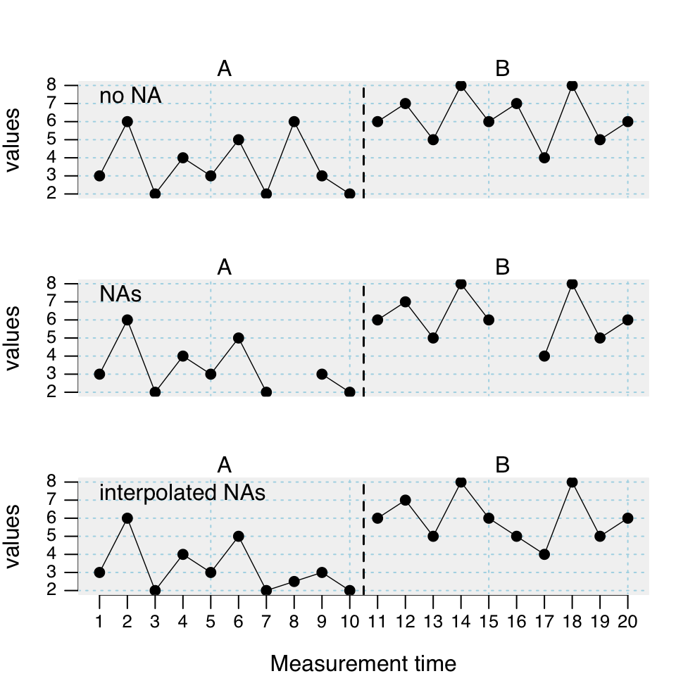
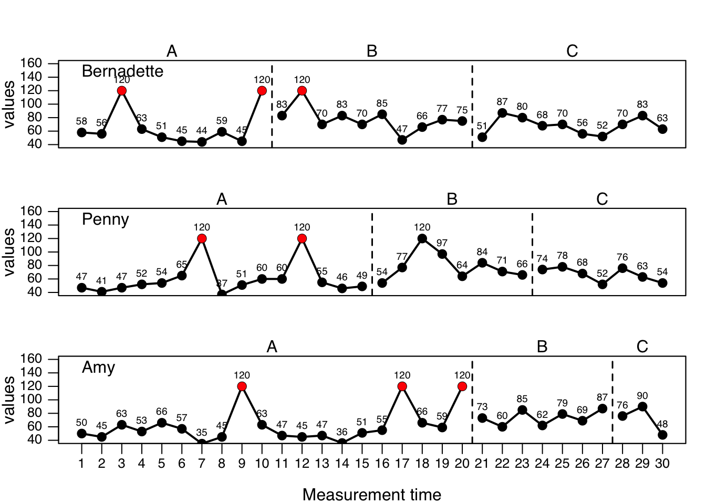

# Describe and manipulate single-case data frames

## Describing and summarizing

A short description of the *scdf* is provided by the `summary` command. The results are pretty much self explaining


```r
summary(Huber2014)
```

```
#A single-case data frame with 4 cases

          Measurements Design
Adam                37    A B
Berta               29    A B
Christian           76    A B
David               76    A B

Variable names:
mt <measurement-time variable>
compliance <dependent variable>
phase <phase variable>


Note:  Behavioral data (compliance in percent).
Author of data:  Christian Huber 
```


```{=html}
<table>
 <tr>
  <td width="75px" style="background-color:#EEEEEE"></td> 
  <td style="background-color:#EEEEEE"><font face="Courier New" size="2"> describe(data, dvar, pvar, mvar) </font></td>
 </tr>
</table>  
``` 

`describe` is the basic command to get an overview on descriptive statistics. As an argument it only takes the name of the *scdf* object. For each case of the *scdf* and each phase within a case descriptive statistics are provided. The output table contains statistical indicators followed by a dot and the name of the phase (e.g., `n.A` for the number of measurements of phase A).

<table class="table table" style="width: auto !important; margin-left: auto; margin-right: auto; margin-left: auto; margin-right: auto;">
<caption>(\#tab:table-describe)Statistics of the describe command</caption>
 <thead>
  <tr>
   <th style="text-align:left;"> Parameter </th>
   <th style="text-align:left;"> What it means ... </th>
  </tr>
 </thead>
<tbody>
  <tr>
   <td style="text-align:left;font-weight: bold;width: 15em; "> n </td>
   <td style="text-align:left;width: 30em; "> Number of measurements. </td>
  </tr>
  <tr>
   <td style="text-align:left;font-weight: bold;width: 15em; "> mis </td>
   <td style="text-align:left;width: 30em; "> Number of missing values. </td>
  </tr>
  <tr>
   <td style="text-align:left;font-weight: bold;width: 15em; "> m </td>
   <td style="text-align:left;width: 30em; "> Mean values. </td>
  </tr>
  <tr>
   <td style="text-align:left;font-weight: bold;width: 15em; "> md </td>
   <td style="text-align:left;width: 30em; "> Median of values. </td>
  </tr>
  <tr>
   <td style="text-align:left;font-weight: bold;width: 15em; "> sd </td>
   <td style="text-align:left;width: 30em; "> Standard deviation of values. </td>
  </tr>
  <tr>
   <td style="text-align:left;font-weight: bold;width: 15em; "> mad </td>
   <td style="text-align:left;width: 30em; "> Median average deviation of values. </td>
  </tr>
  <tr>
   <td style="text-align:left;font-weight: bold;width: 15em; "> min/max </td>
   <td style="text-align:left;width: 30em; "> Min and max of values. </td>
  </tr>
  <tr>
   <td style="text-align:left;font-weight: bold;width: 15em; "> trend </td>
   <td style="text-align:left;width: 30em; "> Slope of a regression line through values by time. </td>
  </tr>
</tbody>
</table>


```r
describe(exampleABC)
```

```
Describe Single-Case Data

Design:  A B C 

        Marie Rosalind Lise
    n.A    10       15   20
    n.B    10        8    7
    n.C    10        7    3
  mis.A     0        0    0
  mis.B     0        0    0
  mis.C     0        0    0

        Marie Rosalind   Lise
    m.A 52.00    52.27  52.35
    m.B 72.10    73.25  73.57
    m.C 68.00    66.43  71.33
   md.A 53.50    52.00  52.00
   md.B 72.50    72.00  73.00
   md.C 69.00    68.00  76.00
   sd.A  8.29     8.15  10.87
   sd.B 11.37    13.13  10.64
   sd.C 12.70    10.49  21.39
  mad.A 11.12     7.41  10.38
  mad.B 10.38    10.38  16.31
  mad.C 17.79    11.86  20.76
  min.A 39.00    37.00  35.00
  min.B 47.00    54.00  60.00
  min.C 51.00    52.00  48.00
  max.A 63.00    65.00  74.00
  max.B 85.00    97.00  87.00
  max.C 87.00    78.00  90.00
trend.A -1.92     0.50  -0.09
trend.B -0.61     0.64   1.93
trend.C -0.19    -2.93 -14.00
```

The resulting table could be exported into a csv file to be used in other software (e.g., to inserted in a word processing document). Therefore, first write the results of the `describeSC` command into an R object and then use the `write.csv` (or `write.csv2` for a German OS system setup) to export the `descriptives` element of the object.


```r
# write the results into a new R object named `res`
res <- describe(exampleABC)
# create a new file containing the descriptives on your harddrive
write.csv(res$descriptives, file = "descriptive data.csv")
```

The file is written to the currently active working directory. If you are not sure where that is, type `getwd()` (you can use the `setwd()` command to define a different working directory. To get further details type `help(setwd)` into R).

<div class="rmdnote">
<p><strong>Conflicting function names</strong><br />
Sometimes R packages include the same function names. For example, the <code>describe()</code> function is also part of the <code>psych</code> package. Now, if you have loaded the <code>psych</code> package with <code>library(psych)</code> after <code>scan</code> the <code>describe()</code> function of scan will be masked (<code>describe()</code> would now call the corresponding function of the <code>psych</code> package).<br />
There are two solutions to this problem:</p>
<ol style="list-style-type: decimal">
<li>activate the <code>psych</code> library before the <code>scan</code> library (now the psych <code>describe()</code> function will be masked) or</li>
<li>include the package name into the function call with the prefix <code>scan::</code>: <code>scan::describe()</code>.</li>
</ol>
</div>

## Autoregression and trendanalyses


```{=html}
<table>
 <tr>
  <td width="75px" style="background-color:#EEEEEE"></td> 
  <td style="background-color:#EEEEEE"><font face="Courier New" size="2"> autocorr(data, dvar, pvar, mvar, lag.max = 3, ...) </font></td>
 </tr>
</table>  
``` 

The `autocorr` function calculates autocorrelations within each phase and across all phases. The `lag.max` argument defines the lag up to which the autocorrelation will be computed. 


```r
autocorr(exampleABC, lag.max = 4)
```

```
Autocorrelations

     case phase lag_1 lag_2 lag_3 lag_4
    Marie     A  0.29 -0.11  0.10  0.12
    Marie     B -0.28 -0.10 -0.14 -0.09
    Marie     C  0.00 -0.33 -0.14 -0.25
    Marie   all  0.21  0.10  0.25  0.12
 Rosalind     A  0.37 -0.29 -0.33 -0.34
 Rosalind     B -0.34  0.24 -0.40  0.04
 Rosalind     C -0.07 -0.32  0.27  0.02
 Rosalind   all  0.49  0.38  0.22  0.17
     Lise     A  0.04 -0.32 -0.05 -0.09
     Lise     B -0.63  0.50 -0.40  0.31
     Lise     C -0.38 -0.12    NA    NA
     Lise   all  0.33  0.36  0.23  0.27
```

The `trendSC` function provides an overview of linear trends in single-case data. By default, it gives you the intercept and slope of a linear and a squared regression of measurement-time on scores. Models are computed separately for each phase and across all phases. For a more advanced application, you can add regression models using the R specific formula class.


```r
# Simple example
trend(exampleABC[1])
```

```
Trend for each phase

            Intercept      B   Beta
Linear.ALL     55.159  0.612  0.392
Linear.A       60.618 -1.915 -0.700
Linear.B       74.855 -0.612 -0.163
Linear.C       68.873 -0.194 -0.046
Squared.ALL    59.135  0.017  0.330
Squared.A      57.937 -0.208 -0.712
Squared.B      73.217 -0.039 -0.098
Squared.C      68.490 -0.017 -0.038

Note. Measurement-times of phase B start at 0 
```

```r
# Complex example
trend(exampleAB$Johanna, offset = 0, 
        model = c("Cubic" = values ~ I(mt^3), "Log Time" = values ~ log(mt))
)
```

```
Trend for each phase

             Intercept      B   Beta
Linear.ALL      50.484  1.787  0.908
Linear.A        54.300  0.100  0.066
Linear.B        61.133  1.625  0.813
Squared.ALL     57.879  0.079  0.871
Squared.A       54.747 -0.013 -0.054
Squared.B       66.343  0.094  0.775
Cubic.ALL       60.886  0.004  0.816
Cubic.A         54.959 -0.008 -0.169
Cubic.B         68.368  0.006  0.732
Log Time.ALL    43.532 12.149  0.848
Log Time.A      54.032  0.593  0.156
Log Time.B      57.300  9.051  0.791

Note. Measurement-times of phase B start at 1 
```

## Missing values

There are two kinds of missing values in single-case data series. First, missings that were explicitly recorded as `NA` and assigned to a phase and measurement-time as in the following example:

```
scdf(c(5, 3, 4, 6, 8, 7, 9, 7, NA, 6), phase.design = c(A = 4, B = 6))
```

The second type of missing occurs when there are gaps between measurement-times that are not explicitly coded as in the following example:

```
scdf(c(5, 3, 4, 6, 8, 7, 9, 7, 6), phase.design = c(A = 4, B = 5), 
     mt = c(1, 2, 3, 4, 5, 6, 7, 8, 10))
```

In both cases, missing values pose a threat to the internal validity of overlap indices. Randomization tests are more robust against the first type of missing values but are affected by the second type. Regression approaches are less impacted by both types as they take the interval between measurement-times into account.  


```r
case1 <- scdf(c(3,6,2,4,3,5,2,6,3,2, 6,7,5,8,6,7,4,8,5,6), 
              phase.design = c(A = 10, B = 10), name = "no NA")
case2 <- scdf(c(3,6,2,4,3,5,2,NA,3,2, 6,7,5,8,6,NA,4,8,5,6), 
              phase.design = c(A = 10, B = 10), name = "NAs")
case3 <- fillmissingSC(case2)
names(case3) <- "interpolated NAs"
ex <- c(case1, case2, case3)
plot(ex)
```



```r
overlap(ex)
```

```
Overlap Indices

Design:  A B 
Comparing phase 1 against phase 2 

              no NA    NAs interpolated NAs
PND           40.00  33.33            30.00
PEM          100.00 100.00           100.00
PET          100.00 100.00           100.00
NAP           88.50  91.36            91.50
NAP.rescaled  77.00  82.72            83.00
PAND          72.50  80.56            80.00
TAU_U          0.45   0.51             0.50
Base_Tau       0.59   0.64             0.64
Diff_mean      2.60   2.78             2.75
Diff_trend     0.02   0.11             0.12
SMD            1.65   1.96             2.02
Hedges_g       1.58   1.87             1.94
```

## Outlieranalysis


```{=html}
<table>
 <tr>
  <td width="75px" style="background-color:#EEEEEE"></td> 
  <td style="background-color:#EEEEEE"><font face="Courier New" size="2"> outlier(data, dvar, pvar, mvar, criteria = c("MAD", "3.5")) </font></td>
 </tr>
</table>  
``` 

*scan* provides several methods for analyzing outliers. All of them are implemented in the `outliers` function. Available methods are the __standard deviation__, __mean average deviation__, __confidence intervals__, and __Cook's distance__. The criteria argument takes a vector with two information, the first defines the analyzing method ("SD", "MAD", CI", "Cook") and the second the criteria. For "SD" the criteria is the number of standard deviations (__sd__) from the mean of each phase for which a value is not considered to be an outlier. For example, `criteria = c("SD",2)` would identify every value exceeding two __sd__ above or below the mean as an outlier whereas __sd__ and mean refer to phase of a value. As this might be misleading particularly for small samples Iglewicz and Hoaglin @iglewicz_how_1993 recommend the use the much more robust median average deviation (__MAD__) instead. The __MAD__ is is constructed similar to the __sd__ but uses the median instead of the mean. Multiplying the __MAD__ by 1.4826 approximates the __sd__ in a normal distributed sample. This corrected MAD is applied in the `outlier` function. A deviation of 3.5 times the corrected __MAD__ from the median is suggested to be an outlier. To use this criterion set `criteria = c("MAD", 3.5)`. `criteria = c("CI", 0.95)` takes exceeding the 95% confidence interval as the criteria for outliers. The Cook's distance method for calculation outliers can be applied with a strict AB-phase design. in that case, the Cook's distance analyses are based on a piecewise-regression model. Most commonly, Cook's distance exceeding 4/n is used as a criteria. This could be implemented setting `criteria = c("Cook","4/n").


```r
outlier(exampleABC_outlier, criteria = c("MAD", 3.5))
```

```
Outlier Analysis for Single-Case Data

Criteria: Exceeds 3.5 Mean Average Deviations

$Bernadette
  phase md mad   lower    upper
1     A 57   9 10.2981 103.7019
2     B 76   7 39.6763 112.3237
3     C 69  12  6.7308 131.2692

$Penny
  phase md mad   lower    upper
1     A 52   6 20.8654  83.1346
2     B 74  10 22.1090 125.8910
3     C 68   8 26.4872 109.5128

$Amy
  phase md mad   lower    upper
1     A 54   9  7.2981 100.7019
2     B 73  11 15.9199 130.0801
3     C 76  14  3.3526 148.6474

Case Bernadette : Dropped 3 
Case Penny : Dropped 2 
Case Amy : Dropped 3 
```

```r
# Visualizing outliers with the plot function
res <- outlier(exampleABC_outlier, criteria = c("MAD", 3.5))
plot(exampleABC_outlier, marks = res, style = "annotate", ylim = c(40,160))
```



## Smoothing data


```{=html}
<table>
 <tr>
  <td width="75px" style="background-color:#EEEEEE"></td> 
  <td style="background-color:#EEEEEE"><font face="Courier New" size="2"> smooth_cases(data, dvar, mvar, FUN = "movingMedian", intensity = NULL) </font></td>
 </tr>
</table>  
``` 

The `smooth_cases` function provides procedures to smooth single-case data and eliminate noise. A moving average function (mean- or median-based) replaces each data point by the average of the surrounding data points step-by-step. A *lag* defines the number of measurements before and after the calculation is based on. So a lag-1 will take the average of the proceeding and following value and lag-2 the average of the two proceeding and two following measurements. With a local regression function, each data point is regressed by its surrounding data points. Here, the proportion of measurements surrounding a value is usually defined. So an intensity of 0.2 will take the surrounding 20% of data as the basis for a regression.  
The function returns am scdf with smoothed data points.


```r
## Use the three different smoothing functions and compare the results
berta_mmd <- smooth_cases(Huber2014$Berta)
berta_mmn <- smooth_cases(Huber2014$Berta, FUN = "movingMean")
berta_lre <- smooth_cases(Huber2014$Berta, FUN = "localRegression")
new_study <- c(Huber2014$Berta, berta_mmd, berta_mmn, berta_lre)
names(new_study) <- c("Original", "Moving Median", "Moving Mean", "Local Regression")
plot(new_study, style = "grid2")
```


