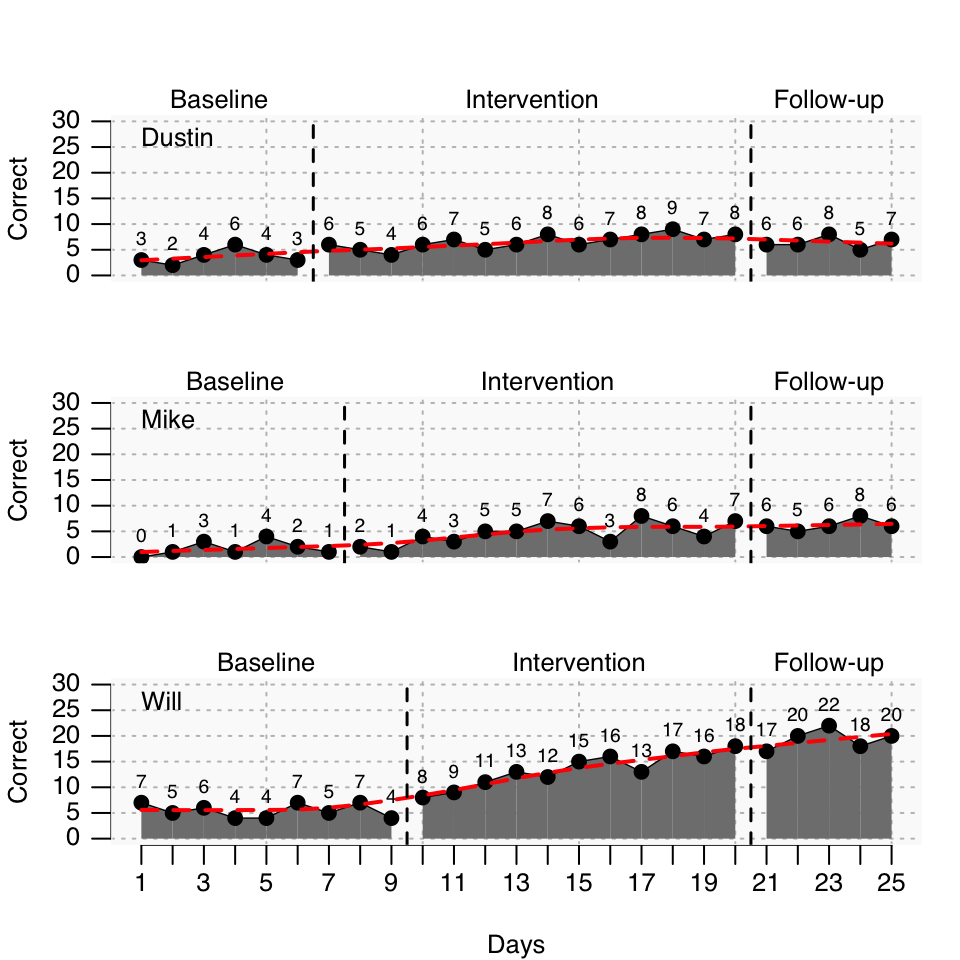

# Introduction

Single case research has become an important and broadly accepted method for gaining insight into educational processes. Especially the field of special education has adopted single-case research as a proper method for evaluating the effectiveness of an intervention or the developmental processes underlying problems in acquiring academic skills. Single-case studies are also popular among teachers and educators who are interested in evaluating the learning progress of their students. The resulting information of a single-case research design provide helpful information for pedagogical decision processes regarding further teaching processes of an individual student but also help to decide, whether or how to implement certain teaching methods into a classroom.  
Despite its usefulness, standards on how to conduct single-case studies, how to analyze the data, and how to present the results is less well developed compared to group based research designs. Moreover, while there is ample software helping to analyse data, most of the software is designed towards analyzing group based data sets. Visualizing single-case data sets oftentimes means to tinker with spreadsheet programs and analyzing becomes a cumbersome endeavor. This book addresses this gap. It has been written around a specialized software tool for managing, visualizing, and analyzing single-case data. This tool is an extension package for the software `R` [@R-base] named `scan`, an acronym for **single-case analyses**.  

## A teaser

Before I go into the details on how `scan` exactly works, I like to provide an example of what you can do with `scan`. It is meant to be a teaser to get you motivated to tackle the steep learning curve associated with the use of `R` (but there is a land of milk and honey behind this curve!). So, do not mind if you do not understand every detail of this example, it will all be explained and obvious to you once you get familiar with `scan`.

Let us set a fictional context. Let us assume you are researching on a method to foster the calculation abilities of struggling fourth grade students. You developed an intervention program named *KUNO*. In a pilot study you like to get some evidence on the effectiveness of that new method and you set up a multi-baseline single-case study comprising three students that take part in the *KUNO* program across a period of ten weeks. Throughout that course you regularly measured the calculation abilities of each student 20 times with a reliable test. You also implemented a follow up after eight weeks with additional five measures. The calculation test gives you the number of correctly solved calculation tasks within ten minutes.  
Now, I invent some data for this fictitious *KUNO* study as it would be to laborious to conduct a real study and actually to evolve a real intervention method.  
We use the `scan` package to code the data. Each case consists of 25 measurements. We have three phases: pre intervention (A), during the intervention (B), and follow-up (C). Phases A and B have different lengths. The cases are named and combined into a single object called `strange_study`.  


```r
case1 <- scdf(
  c(A = 3, 2, 4, 6, 4, 3, 
    B = 6, 5, 4, 6, 7, 5, 6, 8, 6, 7, 8, 9, 7, 8, 
    C = 6, 6, 8, 5, 7), 
  name = "Dustin"
)
case2 <- scdf(
  c(A = 0, 1, 3, 1, 4, 2, 1, 
    B = 2, 1, 4, 3, 5, 5, 7, 6, 3, 8, 6, 4, 7, 
    C = 6, 5, 6, 8, 6), 
  name = "Mike"
)
case3 <- scdf(
  c(A = 7, 5, 6, 4, 4, 7, 5, 7, 4,
    B = 8, 9, 11, 13, 12, 15, 16, 13, 17, 16, 18,
    C = 17, 20, 22, 18, 20), 
  name = "Will"
)
strange_study <- c(case1, case2, case3)
```

Now we visualize the cases:


```r
plot(
  strange_study,
  ylab = "Correct",
  xlab = "Days",
  lines = c("loreg", col = "red"),
  phase.names = c("Baseline", "Intervention", "Follow-up"),
  style = "chart",
  ylim = c(0, 30),
  xinc = 2
)
```



Now we need some descriptive statistics:


```r
describe(strange_study)
```

<table class="table table-bordered table-condensed" style="width: auto !important; margin-left: auto; margin-right: auto;border-bottom: 0;">
<caption>(\#tab:describe_strange_study)Descriptive statistics</caption>
 <thead>
  <tr>
   <th style="text-align:left;"> Parameter </th>
   <th style="text-align:center;"> Dustin </th>
   <th style="text-align:center;"> Mike </th>
   <th style="text-align:center;"> Will </th>
  </tr>
 </thead>
<tbody>
  <tr>
   <td style="text-align:left;"> n A </td>
   <td style="text-align:center;"> 6.00 </td>
   <td style="text-align:center;"> 7.00 </td>
   <td style="text-align:center;"> 9.00 </td>
  </tr>
  <tr>
   <td style="text-align:left;"> n B </td>
   <td style="text-align:center;"> 14.00 </td>
   <td style="text-align:center;"> 13.00 </td>
   <td style="text-align:center;"> 11.00 </td>
  </tr>
  <tr>
   <td style="text-align:left;"> n C </td>
   <td style="text-align:center;"> 5.00 </td>
   <td style="text-align:center;"> 5.00 </td>
   <td style="text-align:center;"> 5.00 </td>
  </tr>
  <tr>
   <td style="text-align:left;"> Missing A </td>
   <td style="text-align:center;"> 0.00 </td>
   <td style="text-align:center;"> 0.00 </td>
   <td style="text-align:center;"> 0.00 </td>
  </tr>
  <tr>
   <td style="text-align:left;"> Missing B </td>
   <td style="text-align:center;"> 0.00 </td>
   <td style="text-align:center;"> 0.00 </td>
   <td style="text-align:center;"> 0.00 </td>
  </tr>
  <tr>
   <td style="text-align:left;"> Missing C </td>
   <td style="text-align:center;"> 0.00 </td>
   <td style="text-align:center;"> 0.00 </td>
   <td style="text-align:center;"> 0.00 </td>
  </tr>
  <tr>
   <td style="text-align:left;"> m A </td>
   <td style="text-align:center;"> 3.67 </td>
   <td style="text-align:center;"> 1.71 </td>
   <td style="text-align:center;"> 5.44 </td>
  </tr>
  <tr>
   <td style="text-align:left;"> m B </td>
   <td style="text-align:center;"> 6.57 </td>
   <td style="text-align:center;"> 4.69 </td>
   <td style="text-align:center;"> 13.45 </td>
  </tr>
  <tr>
   <td style="text-align:left;"> m C </td>
   <td style="text-align:center;"> 6.40 </td>
   <td style="text-align:center;"> 6.20 </td>
   <td style="text-align:center;"> 19.40 </td>
  </tr>
  <tr>
   <td style="text-align:left;"> md A </td>
   <td style="text-align:center;"> 3.50 </td>
   <td style="text-align:center;"> 1.00 </td>
   <td style="text-align:center;"> 5.00 </td>
  </tr>
  <tr>
   <td style="text-align:left;"> md B </td>
   <td style="text-align:center;"> 6.50 </td>
   <td style="text-align:center;"> 5.00 </td>
   <td style="text-align:center;"> 13.00 </td>
  </tr>
  <tr>
   <td style="text-align:left;"> md C </td>
   <td style="text-align:center;"> 6.00 </td>
   <td style="text-align:center;"> 6.00 </td>
   <td style="text-align:center;"> 20.00 </td>
  </tr>
  <tr>
   <td style="text-align:left;"> sd A </td>
   <td style="text-align:center;"> 1.37 </td>
   <td style="text-align:center;"> 1.38 </td>
   <td style="text-align:center;"> 1.33 </td>
  </tr>
  <tr>
   <td style="text-align:left;"> sd B </td>
   <td style="text-align:center;"> 1.40 </td>
   <td style="text-align:center;"> 2.10 </td>
   <td style="text-align:center;"> 3.27 </td>
  </tr>
  <tr>
   <td style="text-align:left;"> sd C </td>
   <td style="text-align:center;"> 1.14 </td>
   <td style="text-align:center;"> 1.10 </td>
   <td style="text-align:center;"> 1.95 </td>
  </tr>
  <tr>
   <td style="text-align:left;"> mad A </td>
   <td style="text-align:center;"> 0.74 </td>
   <td style="text-align:center;"> 1.48 </td>
   <td style="text-align:center;"> 1.48 </td>
  </tr>
  <tr>
   <td style="text-align:left;"> mad B </td>
   <td style="text-align:center;"> 1.48 </td>
   <td style="text-align:center;"> 2.97 </td>
   <td style="text-align:center;"> 4.45 </td>
  </tr>
  <tr>
   <td style="text-align:left;"> mad C </td>
   <td style="text-align:center;"> 1.48 </td>
   <td style="text-align:center;"> 0.00 </td>
   <td style="text-align:center;"> 2.97 </td>
  </tr>
  <tr>
   <td style="text-align:left;"> Min A </td>
   <td style="text-align:center;"> 2.00 </td>
   <td style="text-align:center;"> 0.00 </td>
   <td style="text-align:center;"> 4.00 </td>
  </tr>
  <tr>
   <td style="text-align:left;"> Min B </td>
   <td style="text-align:center;"> 4.00 </td>
   <td style="text-align:center;"> 1.00 </td>
   <td style="text-align:center;"> 8.00 </td>
  </tr>
  <tr>
   <td style="text-align:left;"> Min C </td>
   <td style="text-align:center;"> 5.00 </td>
   <td style="text-align:center;"> 5.00 </td>
   <td style="text-align:center;"> 17.00 </td>
  </tr>
  <tr>
   <td style="text-align:left;"> Max A </td>
   <td style="text-align:center;"> 6.00 </td>
   <td style="text-align:center;"> 4.00 </td>
   <td style="text-align:center;"> 7.00 </td>
  </tr>
  <tr>
   <td style="text-align:left;"> Max B </td>
   <td style="text-align:center;"> 9.00 </td>
   <td style="text-align:center;"> 8.00 </td>
   <td style="text-align:center;"> 18.00 </td>
  </tr>
  <tr>
   <td style="text-align:left;"> Max C </td>
   <td style="text-align:center;"> 8.00 </td>
   <td style="text-align:center;"> 8.00 </td>
   <td style="text-align:center;"> 22.00 </td>
  </tr>
  <tr>
   <td style="text-align:left;"> Trend A </td>
   <td style="text-align:center;"> 0.23 </td>
   <td style="text-align:center;"> 0.21 </td>
   <td style="text-align:center;"> -0.08 </td>
  </tr>
  <tr>
   <td style="text-align:left;"> Trend B </td>
   <td style="text-align:center;"> 0.25 </td>
   <td style="text-align:center;"> 0.36 </td>
   <td style="text-align:center;"> 0.91 </td>
  </tr>
  <tr>
   <td style="text-align:left;"> Trend C </td>
   <td style="text-align:center;"> 0.10 </td>
   <td style="text-align:center;"> 0.30 </td>
   <td style="text-align:center;"> 0.40 </td>
  </tr>
</tbody>
<tfoot>
<tr><td style="padding: 0; " colspan="100%"><span style="font-style: italic;">Note: </span></td></tr>
<tr><td style="padding: 0; " colspan="100%">
<sup></sup> n = Number of measurements; Missing = Number of missing values; M = Mean; Median = Median; SD = Standard deviation; MAD = Median average deviation; Min = Minimum; Max = Maximum; Trend = Slope of dependent variable regressed on measurement-time.</td></tr>
</tfoot>
</table>

Single-case data are oftentimes analyzed with overlap indices. Let us get an overview comparing phases A and B:


```r
overlap(strange_study)
```

<table class="table table-bordered table-condensed" style="width: auto !important; margin-left: auto; margin-right: auto;border-bottom: 0;">
<caption>(\#tab:overlapAB_strange_study)Overlap indices. Comparing phase A against phase B</caption>
 <thead>
  <tr>
   <th style="text-align:left;">   </th>
   <th style="text-align:right;"> Dustin </th>
   <th style="text-align:right;"> Mike </th>
   <th style="text-align:right;"> Will </th>
  </tr>
 </thead>
<tbody>
  <tr>
   <td style="text-align:left;"> PND </td>
   <td style="text-align:right;"> 50.00 </td>
   <td style="text-align:right;"> 53.85 </td>
   <td style="text-align:right;"> 100.00 </td>
  </tr>
  <tr>
   <td style="text-align:left;"> PEM </td>
   <td style="text-align:right;"> 100.00 </td>
   <td style="text-align:right;"> 92.31 </td>
   <td style="text-align:right;"> 100.00 </td>
  </tr>
  <tr>
   <td style="text-align:left;"> PET </td>
   <td style="text-align:right;"> 71.43 </td>
   <td style="text-align:right;"> 61.54 </td>
   <td style="text-align:right;"> 100.00 </td>
  </tr>
  <tr>
   <td style="text-align:left;"> NAP </td>
   <td style="text-align:right;"> 92.86 </td>
   <td style="text-align:right;"> 87.91 </td>
   <td style="text-align:right;"> 100.00 </td>
  </tr>
  <tr>
   <td style="text-align:left;"> NAP-R </td>
   <td style="text-align:right;"> 85.71 </td>
   <td style="text-align:right;"> 75.82 </td>
   <td style="text-align:right;"> 100.00 </td>
  </tr>
  <tr>
   <td style="text-align:left;"> PAND </td>
   <td style="text-align:right;"> 90.00 </td>
   <td style="text-align:right;"> 80.00 </td>
   <td style="text-align:right;"> 100.00 </td>
  </tr>
  <tr>
   <td style="text-align:left;"> Tau-U </td>
   <td style="text-align:right;"> 0.66 </td>
   <td style="text-align:right;"> 0.56 </td>
   <td style="text-align:right;"> 0.80 </td>
  </tr>
  <tr>
   <td style="text-align:left;"> Base_Tau </td>
   <td style="text-align:right;"> 0.60 </td>
   <td style="text-align:right;"> 0.55 </td>
   <td style="text-align:right;"> 0.74 </td>
  </tr>
  <tr>
   <td style="text-align:left;"> Delta M </td>
   <td style="text-align:right;"> 2.90 </td>
   <td style="text-align:right;"> 2.98 </td>
   <td style="text-align:right;"> 8.01 </td>
  </tr>
  <tr>
   <td style="text-align:left;"> Delta Trend </td>
   <td style="text-align:right;"> 0.02 </td>
   <td style="text-align:right;"> 0.14 </td>
   <td style="text-align:right;"> 0.99 </td>
  </tr>
  <tr>
   <td style="text-align:left;"> SMD </td>
   <td style="text-align:right;"> 2.13 </td>
   <td style="text-align:right;"> 2.16 </td>
   <td style="text-align:right;"> 6.01 </td>
  </tr>
  <tr>
   <td style="text-align:left;"> Hedges g </td>
   <td style="text-align:right;"> 2.04 </td>
   <td style="text-align:right;"> 2.07 </td>
   <td style="text-align:right;"> 5.75 </td>
  </tr>
</tbody>
<tfoot>
<tr><td style="padding: 0; " colspan="100%"><span style="font-style: italic;">Note: </span></td></tr>
<tr><td style="padding: 0; " colspan="100%">
<sup></sup> PND = Percentage Non-Overlapping Data; PEM = Percentage Exceeding the Median; PET = Percentage Exceeding the Trend; NAP = Nonoverlap of all pairs; NAP-R = NAP rescaled; PAND = Percentage all nonoverlapping data;Tau U = Parker's Tau-U; Base Tau = Baseline corrected Tau; Delta M = Mean difference between phases; Delta Trend = Trend difference between phases; SMD = Standardized Mean Difference; Hedges g = Corrected SMD.</td></tr>
</tfoot>
</table>

How do the changes hold up against the follow-up? Let us compare phases A and C:


```r
overlap(strange_study, phases = c("A", "C"))
```


<table class="table table-bordered table-condensed" style="width: auto !important; margin-left: auto; margin-right: auto;border-bottom: 0;">
<caption>(\#tab:overlapAC_strange_study)Overlap indices. Comparing phase A against phase C</caption>
 <thead>
  <tr>
   <th style="text-align:left;">   </th>
   <th style="text-align:right;"> Dustin </th>
   <th style="text-align:right;"> Mike </th>
   <th style="text-align:right;"> Will </th>
  </tr>
 </thead>
<tbody>
  <tr>
   <td style="text-align:left;"> PND </td>
   <td style="text-align:right;"> 40.00 </td>
   <td style="text-align:right;"> 100.00 </td>
   <td style="text-align:right;"> 100.00 </td>
  </tr>
  <tr>
   <td style="text-align:left;"> PEM </td>
   <td style="text-align:right;"> 100.00 </td>
   <td style="text-align:right;"> 100.00 </td>
   <td style="text-align:right;"> 100.00 </td>
  </tr>
  <tr>
   <td style="text-align:left;"> PET </td>
   <td style="text-align:right;"> 0.00 </td>
   <td style="text-align:right;"> 60.00 </td>
   <td style="text-align:right;"> 100.00 </td>
  </tr>
  <tr>
   <td style="text-align:left;"> NAP </td>
   <td style="text-align:right;"> 93.33 </td>
   <td style="text-align:right;"> 100.00 </td>
   <td style="text-align:right;"> 100.00 </td>
  </tr>
  <tr>
   <td style="text-align:left;"> NAP-R </td>
   <td style="text-align:right;"> 86.67 </td>
   <td style="text-align:right;"> 100.00 </td>
   <td style="text-align:right;"> 100.00 </td>
  </tr>
  <tr>
   <td style="text-align:left;"> PAND </td>
   <td style="text-align:right;"> 81.82 </td>
   <td style="text-align:right;"> 100.00 </td>
   <td style="text-align:right;"> 100.00 </td>
  </tr>
  <tr>
   <td style="text-align:left;"> Tau-U </td>
   <td style="text-align:right;"> 0.46 </td>
   <td style="text-align:right;"> 0.51 </td>
   <td style="text-align:right;"> 0.61 </td>
  </tr>
  <tr>
   <td style="text-align:left;"> Base_Tau </td>
   <td style="text-align:right;"> 0.67 </td>
   <td style="text-align:right;"> 0.76 </td>
   <td style="text-align:right;"> 0.74 </td>
  </tr>
  <tr>
   <td style="text-align:left;"> Delta M </td>
   <td style="text-align:right;"> 2.73 </td>
   <td style="text-align:right;"> 4.49 </td>
   <td style="text-align:right;"> 13.96 </td>
  </tr>
  <tr>
   <td style="text-align:left;"> Delta Trend </td>
   <td style="text-align:right;"> -0.13 </td>
   <td style="text-align:right;"> 0.09 </td>
   <td style="text-align:right;"> 0.48 </td>
  </tr>
  <tr>
   <td style="text-align:left;"> SMD </td>
   <td style="text-align:right;"> 2.00 </td>
   <td style="text-align:right;"> 3.25 </td>
   <td style="text-align:right;"> 10.47 </td>
  </tr>
  <tr>
   <td style="text-align:left;"> Hedges g </td>
   <td style="text-align:right;"> 1.83 </td>
   <td style="text-align:right;"> 3.00 </td>
   <td style="text-align:right;"> 9.80 </td>
  </tr>
</tbody>
<tfoot>
<tr><td style="padding: 0; " colspan="100%"><span style="font-style: italic;">Note: </span></td></tr>
<tr><td style="padding: 0; " colspan="100%">
<sup></sup> PND = Percentage Non-Overlapping Data; PEM = Percentage Exceeding the Median; PET = Percentage Exceeding the Trend; NAP = Nonoverlap of all pairs; NAP-R = NAP rescaled; PAND = Percentage all nonoverlapping data;Tau U = Parker's Tau-U; Base Tau = Baseline corrected Tau; Delta M = Mean difference between phases; Delta Trend = Trend difference between phases; SMD = Standardized Mean Difference; Hedges g = Corrected SMD.</td></tr>
</tfoot>
</table>

Finally, we conduct regression analyses for each cases with a piecewise regression model:


```r
plm(strange_study$Dustin)
plm(strange_study$Mike)
plm(strange_study$Will)
```

<table class="table table-bordered table-condensed" style="width: auto !important; margin-left: auto; margin-right: auto;border-bottom: 0;">
<caption>(\#tab:plm_strange_study)Piecewise-regression model predicting variable 'values'</caption>
 <thead>
<tr>
<th style="empty-cells: hide;border-bottom:hidden;" colspan="2"></th>
<th style="border-bottom:hidden;padding-bottom:0; padding-left:3px;padding-right:3px;text-align: center; " colspan="2"><div style="border-bottom: 1px solid #ddd; padding-bottom: 5px; ">CI(95%)</div></th>
<th style="empty-cells: hide;border-bottom:hidden;" colspan="4"></th>
</tr>
  <tr>
   <th style="text-align:left;"> Parameter </th>
   <th style="text-align:right;"> B </th>
   <th style="text-align:right;"> 2.5% </th>
   <th style="text-align:right;"> 97.5% </th>
   <th style="text-align:right;"> SE </th>
   <th style="text-align:right;"> t </th>
   <th style="text-align:right;"> p </th>
   <th style="text-align:right;"> Delta R² </th>
  </tr>
 </thead>
<tbody>
  <tr>
   <td style="text-align:left;"> Intercept </td>
   <td style="text-align:right;"> 2.87 </td>
   <td style="text-align:right;"> 0.77 </td>
   <td style="text-align:right;"> 4.97 </td>
   <td style="text-align:right;"> 1.07 </td>
   <td style="text-align:right;"> 2.68 </td>
   <td style="text-align:right;"> &lt;.05 </td>
   <td style="text-align:right;">  </td>
  </tr>
  <tr>
   <td style="text-align:left;"> Trend mt </td>
   <td style="text-align:right;"> 0.23 </td>
   <td style="text-align:right;"> -0.31 </td>
   <td style="text-align:right;"> 0.77 </td>
   <td style="text-align:right;"> 0.28 </td>
   <td style="text-align:right;"> 0.83 </td>
   <td style="text-align:right;"> .41 </td>
   <td style="text-align:right;"> .01 </td>
  </tr>
  <tr>
   <td style="text-align:left;"> Level phase B </td>
   <td style="text-align:right;"> 0.49 </td>
   <td style="text-align:right;"> -1.58 </td>
   <td style="text-align:right;"> 2.56 </td>
   <td style="text-align:right;"> 1.06 </td>
   <td style="text-align:right;"> 0.46 </td>
   <td style="text-align:right;"> .64 </td>
   <td style="text-align:right;"> .00 </td>
  </tr>
  <tr>
   <td style="text-align:left;"> Level phase C </td>
   <td style="text-align:right;"> -1.34 </td>
   <td style="text-align:right;"> -10.59 </td>
   <td style="text-align:right;"> 7.91 </td>
   <td style="text-align:right;"> 4.72 </td>
   <td style="text-align:right;"> -0.28 </td>
   <td style="text-align:right;"> .77 </td>
   <td style="text-align:right;"> .00 </td>
  </tr>
  <tr>
   <td style="text-align:left;"> Slope phase B </td>
   <td style="text-align:right;"> 0.02 </td>
   <td style="text-align:right;"> -0.54 </td>
   <td style="text-align:right;"> 0.58 </td>
   <td style="text-align:right;"> 0.29 </td>
   <td style="text-align:right;"> 0.06 </td>
   <td style="text-align:right;"> .95 </td>
   <td style="text-align:right;"> .00 </td>
  </tr>
  <tr>
   <td style="text-align:left;"> Slope phase C </td>
   <td style="text-align:right;"> -0.13 </td>
   <td style="text-align:right;"> -1.02 </td>
   <td style="text-align:right;"> 0.77 </td>
   <td style="text-align:right;"> 0.46 </td>
   <td style="text-align:right;"> -0.28 </td>
   <td style="text-align:right;"> .78 </td>
   <td style="text-align:right;"> .00 </td>
  </tr>
</tbody>
<tfoot>
<tr><td style="padding: 0; " colspan="100%"><span style="font-style: italic;">Note: </span></td></tr>
<tr><td style="padding: 0; " colspan="100%">
<sup></sup> F(5, 19) = 7.88; p &lt;.001; R² = 0.675; Adjusted R² = 0.589</td></tr>
</tfoot>
</table>

<table class="table table-bordered table-condensed" style="width: auto !important; margin-left: auto; margin-right: auto;border-bottom: 0;">
<caption>(\#tab:plm_strange_study)Piecewise-regression model predicting variable 'values'</caption>
 <thead>
<tr>
<th style="empty-cells: hide;border-bottom:hidden;" colspan="2"></th>
<th style="border-bottom:hidden;padding-bottom:0; padding-left:3px;padding-right:3px;text-align: center; " colspan="2"><div style="border-bottom: 1px solid #ddd; padding-bottom: 5px; ">CI(95%)</div></th>
<th style="empty-cells: hide;border-bottom:hidden;" colspan="4"></th>
</tr>
  <tr>
   <th style="text-align:left;"> Parameter </th>
   <th style="text-align:right;"> B </th>
   <th style="text-align:right;"> 2.5% </th>
   <th style="text-align:right;"> 97.5% </th>
   <th style="text-align:right;"> SE </th>
   <th style="text-align:right;"> t </th>
   <th style="text-align:right;"> p </th>
   <th style="text-align:right;"> Delta R² </th>
  </tr>
 </thead>
<tbody>
  <tr>
   <td style="text-align:left;"> Intercept </td>
   <td style="text-align:right;"> 0.86 </td>
   <td style="text-align:right;"> -1.65 </td>
   <td style="text-align:right;"> 3.37 </td>
   <td style="text-align:right;"> 1.28 </td>
   <td style="text-align:right;"> 0.67 </td>
   <td style="text-align:right;"> .51 </td>
   <td style="text-align:right;">  </td>
  </tr>
  <tr>
   <td style="text-align:left;"> Trend mt </td>
   <td style="text-align:right;"> 0.21 </td>
   <td style="text-align:right;"> -0.35 </td>
   <td style="text-align:right;"> 0.78 </td>
   <td style="text-align:right;"> 0.29 </td>
   <td style="text-align:right;"> 0.75 </td>
   <td style="text-align:right;"> .46 </td>
   <td style="text-align:right;"> .01 </td>
  </tr>
  <tr>
   <td style="text-align:left;"> Level phase B </td>
   <td style="text-align:right;"> -0.16 </td>
   <td style="text-align:right;"> -2.84 </td>
   <td style="text-align:right;"> 2.51 </td>
   <td style="text-align:right;"> 1.36 </td>
   <td style="text-align:right;"> -0.12 </td>
   <td style="text-align:right;"> .90 </td>
   <td style="text-align:right;"> .00 </td>
  </tr>
  <tr>
   <td style="text-align:left;"> Level phase C </td>
   <td style="text-align:right;"> 0.16 </td>
   <td style="text-align:right;"> -9.41 </td>
   <td style="text-align:right;"> 9.73 </td>
   <td style="text-align:right;"> 4.88 </td>
   <td style="text-align:right;"> 0.03 </td>
   <td style="text-align:right;"> .97 </td>
   <td style="text-align:right;"> .00 </td>
  </tr>
  <tr>
   <td style="text-align:left;"> Slope phase B </td>
   <td style="text-align:right;"> 0.14 </td>
   <td style="text-align:right;"> -0.46 </td>
   <td style="text-align:right;"> 0.75 </td>
   <td style="text-align:right;"> 0.31 </td>
   <td style="text-align:right;"> 0.46 </td>
   <td style="text-align:right;"> .64 </td>
   <td style="text-align:right;"> .00 </td>
  </tr>
  <tr>
   <td style="text-align:left;"> Slope phase C </td>
   <td style="text-align:right;"> 0.09 </td>
   <td style="text-align:right;"> -1.01 </td>
   <td style="text-align:right;"> 1.18 </td>
   <td style="text-align:right;"> 0.56 </td>
   <td style="text-align:right;"> 0.15 </td>
   <td style="text-align:right;"> .87 </td>
   <td style="text-align:right;"> .00 </td>
  </tr>
</tbody>
<tfoot>
<tr><td style="padding: 0; " colspan="100%"><span style="font-style: italic;">Note: </span></td></tr>
<tr><td style="padding: 0; " colspan="100%">
<sup></sup> F(5, 19) = 8.00; p &lt;.001; R² = 0.678; Adjusted R² = 0.593</td></tr>
</tfoot>
</table>

<table class="table table-bordered table-condensed" style="width: auto !important; margin-left: auto; margin-right: auto;border-bottom: 0;">
<caption>(\#tab:plm_strange_study)Piecewise-regression model predicting variable 'values'</caption>
 <thead>
<tr>
<th style="empty-cells: hide;border-bottom:hidden;" colspan="2"></th>
<th style="border-bottom:hidden;padding-bottom:0; padding-left:3px;padding-right:3px;text-align: center; " colspan="2"><div style="border-bottom: 1px solid #ddd; padding-bottom: 5px; ">CI(95%)</div></th>
<th style="empty-cells: hide;border-bottom:hidden;" colspan="4"></th>
</tr>
  <tr>
   <th style="text-align:left;"> Parameter </th>
   <th style="text-align:right;"> B </th>
   <th style="text-align:right;"> 2.5% </th>
   <th style="text-align:right;"> 97.5% </th>
   <th style="text-align:right;"> SE </th>
   <th style="text-align:right;"> t </th>
   <th style="text-align:right;"> p </th>
   <th style="text-align:right;"> Delta R² </th>
  </tr>
 </thead>
<tbody>
  <tr>
   <td style="text-align:left;"> Intercept </td>
   <td style="text-align:right;"> 5.86 </td>
   <td style="text-align:right;"> 3.71 </td>
   <td style="text-align:right;"> 8.01 </td>
   <td style="text-align:right;"> 1.10 </td>
   <td style="text-align:right;"> 5.35 </td>
   <td style="text-align:right;"> &lt;.001 </td>
   <td style="text-align:right;">  </td>
  </tr>
  <tr>
   <td style="text-align:left;"> Trend mt </td>
   <td style="text-align:right;"> -0.08 </td>
   <td style="text-align:right;"> -0.46 </td>
   <td style="text-align:right;"> 0.30 </td>
   <td style="text-align:right;"> 0.19 </td>
   <td style="text-align:right;"> -0.43 </td>
   <td style="text-align:right;"> .67 </td>
   <td style="text-align:right;"> .00 </td>
  </tr>
  <tr>
   <td style="text-align:left;"> Level phase B </td>
   <td style="text-align:right;"> 2.89 </td>
   <td style="text-align:right;"> 0.25 </td>
   <td style="text-align:right;"> 5.53 </td>
   <td style="text-align:right;"> 1.35 </td>
   <td style="text-align:right;"> 2.15 </td>
   <td style="text-align:right;"> &lt;.05 </td>
   <td style="text-align:right;"> .01 </td>
  </tr>
  <tr>
   <td style="text-align:left;"> Level phase C </td>
   <td style="text-align:right;"> 14.01 </td>
   <td style="text-align:right;"> 7.42 </td>
   <td style="text-align:right;"> 20.59 </td>
   <td style="text-align:right;"> 3.36 </td>
   <td style="text-align:right;"> 4.17 </td>
   <td style="text-align:right;"> &lt;.001 </td>
   <td style="text-align:right;"> .05 </td>
  </tr>
  <tr>
   <td style="text-align:left;"> Slope phase B </td>
   <td style="text-align:right;"> 0.99 </td>
   <td style="text-align:right;"> 0.52 </td>
   <td style="text-align:right;"> 1.47 </td>
   <td style="text-align:right;"> 0.24 </td>
   <td style="text-align:right;"> 4.10 </td>
   <td style="text-align:right;"> &lt;.001 </td>
   <td style="text-align:right;"> .05 </td>
  </tr>
  <tr>
   <td style="text-align:left;"> Slope phase C </td>
   <td style="text-align:right;"> 0.48 </td>
   <td style="text-align:right;"> -0.53 </td>
   <td style="text-align:right;"> 1.49 </td>
   <td style="text-align:right;"> 0.52 </td>
   <td style="text-align:right;"> 0.94 </td>
   <td style="text-align:right;"> .35 </td>
   <td style="text-align:right;"> .00 </td>
  </tr>
</tbody>
<tfoot>
<tr><td style="padding: 0; " colspan="100%"><span style="font-style: italic;">Note: </span></td></tr>
<tr><td style="padding: 0; " colspan="100%">
<sup></sup> F(5, 19) = 68.16; p &lt;.001; R² = 0.947; Adjusted R² = 0.933</td></tr>
</tfoot>
</table>

