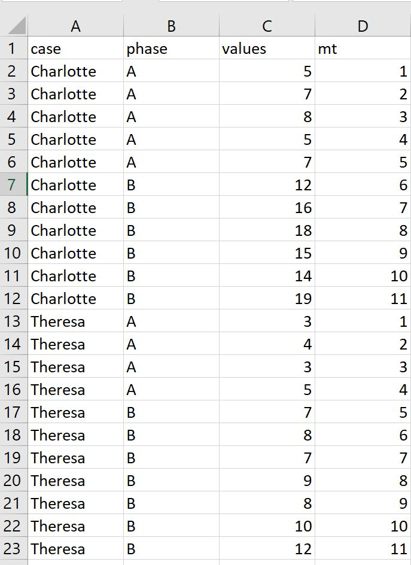

# Managing single-case data

## A ***single-case data frame***

Scan provides its own data-class for encoding single-case data: the *single-case data frame* (short *scdf*). An *scdf* is an object that contains one or multiple single-case data sets and is optimized for managing and displaying these data. Think of an scdf as a file including a separate datasheet for each single case. Each datasheet is made up of at least three variables: The measured **values**, the **phase** identifier for each measured value, and the measurement time (**mt**) of each measure. Optionally, scdfs could include further variables for each single-case (e.g., control variables), and also a name for each case.

<div class="rmdnote">
<p>Technically, an scdf object is a list containing data frames. It is of the class <code>c("scdf","list")</code>. Additionally, an <em>scdf</em> entails an attribute <code>scdf</code> with a list with further attributes. <code>var.values</code>, <code>var.phase</code>, and <code>var.mt</code> contain the names of the <code>values</code>, <code>phase</code>, and the <code>measurement time</code> variable. By default, these names are set to <code>values</code>, <code>phase</code>, and <code>mt</code>.</p>
</div>

Several functions are available for creating, transforming, merging, and importing/exporting *scdfs*.

## Creating scdfs


```{=html}
<table>
 <tr>
  <td width="75px" style="background-color:#EEEEEE"></td> 
  <td style="background-color:#EEEEEE"><font face="Courier New" size="2"> scdf(values, B.start, mt, phase, phase.design, name, dvar = "values", pvar = "phase", mvar = "mt", ...) </font></td>
 </tr>
</table>  
``` 

The `scdf` function is the basic tool for creating a single-case data frame. Basically, you have to provide the measurement *values* and the *phase* structure and a scdf object is build. There are three different ways of defining the phase structure. First, defining the beginning of the B-phase with the `B.start` argument, second, defining a design with the `phase.design` argument and third, setting parameters in a named vector of the dependent variable.


```r
### Three ways to code the same scdf
scdf(values = c(A = 2,2,4,5, B = 8,7,6,9,8,7))
scdf(values = c(2,2,4,5,8,7,6,9,8,7), B.start = 5)
scdf(values = c(2,2,4,5,8,7,6,9,8,7), phase.design = c(A = 4, B = 6))
```

The `B.start` argument is only applicable when the single-case consists of a single A-phase followed by a B-phase. It is a remnant from the time when `scan` could only handle sign-case designs with two phases. The number assigned to `B.start` indicates the measurement-time as defined in the `mt` argument. That is, assume a vector for the measurement times `mt = c(1,3,7,10,15,17,18,20)` and `B.start = 15` then the first measurement of the B-phase will start with the fifth measurement at which *mt* = 15.\
The `phase.design` argument is a named vector with the name and length of each phase. The phase names can be set arbitrary, although I recommend to use capital letters (A, B, C, ...) for each phase followed by, when indicated, a number if the phases repeat (A1, B1, A2, B2, ...). Although it is possible to give the same name to more than one phase (A, B, A, B) this might lead to some confusion and errors when coding analyzes with *scan*.\
When the vector of the dependent variable includes named values, a phase.design structure is created automatically. Each named value sets the beginning of a new phase. For example `c(A = 3,2,4, B = 5,4,3, C = 6,7,6,5)` will create an ABC-phase design with 3, 3, and 4 values per phase.\
Use only one of the three methods at a time and I recommend to use the `phase.design` argument or the named vector method as they are the most versatile.\
If no measurement times are given, scdf automatically adds them numbered sequentially 1, 2, 3, ..., *N* where *N* is the number of measurements. in some circumstances it might be useful to define individual measurement times for each measurement. For example, if you want to include the days since the beginning of the study as time intervals between measurements are widely varying you might get more valid results this way when analyzing the data in a regression approach.


```r
# example of a more complex design 
scdf(
  values = c(2,2,4,5, 8,7,6,9,8,7, 12,11,13), 
  mt = c(1,2,3,6, 8,9,11,12,16,18, 27,28,29),
  phase.design = c(A = 4, B = 6, C = 3)
)
```

```
#A single-case data frame with one case

 Case1: values mt phase
             2  1     A
             2  2     A
             4  3     A
             5  6     A
             8  8     B
             7  9     B
             6 11     B
             9 12     B
             8 16     B
             7 18     B
            12 27     C
            11 28     C
            13 29     C
```

Missing values could be coded using `NA`.


```r
scdf(values = c(A = 2,2,NA,5, B = 8,7,6,9,NA,7))
```

More variables are implemented by adding new variable names with a vector containing the values. Please be aware that a new variable must never have the same name as one of the arguments of the function (i.e. B.start, phase.design, name, dvar, pvar, mvar).


```r
scdf(
  values = c(A = 2,2,3,5, B = 8,7,6,9,7,7), 
  teacher = c(0,0,1,1,0,1,1,1,0,1), 
  hour = c(2,3,4,3,3,1,6,5,2,2)
)
```

```
#A single-case data frame with one case

 Case1: values teacher hour mt phase
             2       0    2  1     A
             2       0    3  2     A
             3       1    4  3     A
             5       1    3  4     A
             8       0    3  5     B
             7       1    1  6     B
             6       1    6  7     B
             9       1    5  8     B
             7       0    2  9     B
             7       1    2 10     B
```

Table \@ref(tab:table-scdf) shows a complete list of arguments that could be passed to the function.

<table class="table table" style="width: auto !important; margin-left: auto; margin-right: auto; margin-left: auto; margin-right: auto;">
<caption>(\#tab:table-scdf)Arguments of the scdf function</caption>
 <thead>
  <tr>
   <th style="text-align:left;"> Argument </th>
   <th style="text-align:left;"> What it does ... </th>
  </tr>
 </thead>
<tbody>
  <tr>
   <td style="text-align:left;font-weight: bold;width: 15em; "> values </td>
   <td style="text-align:left;width: 30em; "> The default vector with values for the dependent variable. It can be changed with the dvar argument. </td>
  </tr>
  <tr>
   <td style="text-align:left;font-weight: bold;width: 15em; "> phase </td>
   <td style="text-align:left;width: 30em; "> Usually, this variable is not defined manually and will be created by the function. It is the default vector with values for the phase variable. It can be changed with the pvar argument. </td>
  </tr>
  <tr>
   <td style="text-align:left;font-weight: bold;width: 15em; "> mt </td>
   <td style="text-align:left;width: 30em; "> The default vector with values for the measurement-time variable. It can be changed with the mvar argument. </td>
  </tr>
  <tr>
   <td style="text-align:left;font-weight: bold;width: 15em; "> phase.design </td>
   <td style="text-align:left;width: 30em; "> A vector defining the length and label of each phase. </td>
  </tr>
  <tr>
   <td style="text-align:left;font-weight: bold;width: 15em; "> B.start </td>
   <td style="text-align:left;width: 30em; "> The first measurement of phase B (simple coding if design is strictly AB). </td>
  </tr>
  <tr>
   <td style="text-align:left;font-weight: bold;width: 15em; "> name </td>
   <td style="text-align:left;width: 30em; "> A name for the case. </td>
  </tr>
  <tr>
   <td style="text-align:left;font-weight: bold;width: 15em; "> dvar </td>
   <td style="text-align:left;width: 30em; "> The name of the dependent variable. By default this is 'values'. </td>
  </tr>
  <tr>
   <td style="text-align:left;font-weight: bold;width: 15em; "> pvar </td>
   <td style="text-align:left;width: 30em; "> The name of the variable containing the phase information. By default this is 'phase'. </td>
  </tr>
  <tr>
   <td style="text-align:left;font-weight: bold;width: 15em; "> mvar </td>
   <td style="text-align:left;width: 30em; "> The name of the variable with the measurement-time. The default is 'mt'. </td>
  </tr>
  <tr>
   <td style="text-align:left;font-weight: bold;width: 15em; "> ... </td>
   <td style="text-align:left;width: 30em; "> Any number of variables with a vector asigned to them. </td>
  </tr>
</tbody>
</table>

If you want to create a data-set comprising several single-cases the easiest way is to first create an scdf for each case and then join them into a new scdf with the `c` command:


```r
case1 <- scdf(
  values = c(A = 5, 7, 10, 5, 12, B = 7, 10, 18, 15, 14, 19), 
  name = "Charlotte"
)
case2 <- scdf(
  values = c(A = 3, 4, 3, 5, B = 7, 4, 7, 9, 8, 10, 12), 
  name = "Theresa"
)
case3 <- scdf(
  values = c(A = 9, 8, 8, 7, 5, 7, B = 6, 14, 15, 12, 16), 
  name = "Antonia"
)
mbd <- c(case1, case2, case3)
```

If you like to use other than the default variable names ("values", "phase", and "mt") you could define these with the `dvar` (for the dependent variable), `pvar` (the variable indicating the phase), and `mvar` (the measurement-time variable) arguments.


```r
# Example: Using a different name for the dependent variable
case <- scdf(
  score = c(A = 5, 7, 10, 5, 12, B = 7, 10, 18, 15, 14, 19), 
  dvar = "score"
)

# Example: Using new names for the dependent and the phase variables
case <- scdf(
  score = c(A = 3, 4, 3, 5, B = 7, 4, 7, 9, 8, 10, 12), 
  dvar = "score", pvar = "section"
)

# Example: Using new names for dependent, phase, and measurement-time variables
case <- scdf(
  score = c(A = 9, 8, 8, 7, 5, 7, B = 6, 14, 15, 12, 16), 
  name = "Antonia", dvar = "score", pvar = "section", mvar = "day"
)

summary(case)
```

```
#A single-case data frame with one case

        Measurements Design
Antonia           11    A B

Variable names:
score <dependent variable>
day <measurement-time variable>
section <phase variable>
```

## Saving and reading *single-case data frames*

Usually, it is not needed to save an scdf to a separate file on your computer. In most of the cases you could keep the coding of the *scdf* as described above and rerun it every time that you are working with your data. But sometimes it is more convenient to separately save the data to a file for later use or to send them to a colleague.\
The simplest way is to use the base *R* functions `saveRDS` and `readRDS` for this purpose. `saveRDS` takes at least two arguments: the first is the object you like to save and the second is a file name for the resulting file. If you have an *scdf* with the name `study1` the line `saveRDS(study1, "study1.rds")` will save the *scdf* to your drive. You could later read this file with `study1 <- readRDS("study1.rds")`. `getwd()` will return the current active folder that you are working in.

## Import and export *single-case data frames*


```{=html}
<table>
 <tr>
  <td width="75px" style="background-color:#EEEEEE"></td> 
  <td style="background-color:#EEEEEE"><font face="Courier New" size="2"> readSC(filename = NULL, data = NULL, sep = ",", dec = ".", sort.labels = FALSE, cvar = "case", pvar = "phase", dvar = "values", mvar = "mt", phase.names = NULL, type = "csv", ...) </font></td>
 </tr>
</table>  
``` 

When you are working with other programs besides **R** you need to export and import the *scdf* into a common file format. `readSC` imports a comma-separated-variable (*csv*) file and converts it into an *scdf* object. By default, the csv-file has to contain the columns *case*, *phase*, and *values*. Optionally, a further column named *mt* could be provided. The csv file should be build up like this:

{width="300px"}

In case your variables names differ from the standard (i.e. "case", "values", "phase", and "mt" ), you could set additional arguments to fit your file. `readSC("example.csv", cvar = "name", dvar = "wellbeing", pvar = "intervention", mvar = "time")` for example will set the variables attributes of the resulting scdf. Cases will be split by the variable `"name"`, `"wellbeing"` is set as the dependent variable (default is *values*), phase information are in the variable `"intervention"`, and measurement times in the variable `"time"`. You could also reassign the phase names within the phase variable by setting the argument `phase.names`. Assume for example your file contains the values 0 and 1 to identify the two phases I recommend to set them to "A" and "B" with `readSC("example.csv", phase.names = c("A", "B"))`.


```r
dat <- readSC.excel(
  "example2.xlsx", cvar = "name", pvar = "intervention", 
  dvar = "wellbeing", mvar = "time", phase.names = c("A","B")
)
```

```
Imported 20 cases.
```

```r
summary(dat)
```

```
#A single-case data frame with 20 cases

         Measurements Design
Charles            20    A B
Kolten             20    A B
Annika             20    A B
Kaysen             20    A B
Urijah             20    A B
Leila              20    A B
Leia               20    A B
Aleigha            20    A B
Greta              20    A B
Alijah             20    A B
Ricardo            20    A B
Dallas             20    A B
Edith              20    A B
Braylee            20    A B
Giovanni           20    A B
Ismael             20    A B
Grady              20    A B
Raina              20    A B
Cambria            20    A B
Lincoln            20    A B

Variable names:
intervention <phase variable>
wellbeing <dependent variable>
time <measurement-time variable>
age
gender
gym
```

For some reasons, computer systems with a German (and some other) language setups export csv-files by default with a comma as a decimal point and a semicolon as a separator between values. In these cases you have to set two extra arguments to import the data:

`readSC("example.csv", dec = ",", sep = ";")`

`readSC.excel` allows for directly importing *Microsoft Excel* `.xlsx` or `.xls` files. You need to have the library `readxl` installed in your R setup for this to work.


```{=html}
<table>
 <tr>
  <td width="75px" style="background-color:#EEEEEE"></td> 
  <td style="background-color:#EEEEEE"><font face="Courier New" size="2"> writeSC(data, filename = NULL, sep = ",", dec = ".", ...) </font></td>
 </tr>
</table>  
``` 

`writeSC` exports an scdf object as a comma-separated-variables file (*csv*) which can be imported into any other software for data analyses (MS OFFICE, Libre Office etc.). The scdf object is converted into a single data frame with a *case* variable identifying the rows for each subject. The first argument of the command identifies the scdf to be exported and the second argument (`file`) the name of the resulting csv-file. If no file argument is provided, a dialog box is opened to choose a file interactively. By default, writeSC exports into a standard csv-format with a dot as the decimal point and a comma for separating variables. If your system expects a comma instead of a point for decimal numbers you may use the `dec` and the `sep` arguments. For example, `writeSC(example, file = "example.csv", dec = ",", sep = ";")` exports a csv variation usually used for example in Germany.

## Displaying and manipulating scdf-files

*scdf* are displayed by just typing the name of the object.


```r
#Beretvas2008 is an example scdf included in scan
Beretvas2008
```

```
#A single-case data frame with one case

 Case1: values mt phase
           0.7  1     A
           1.6  2     A
           1.4  3     A
           1.6  4     A
           1.9  5     A
           1.2  6     A
           1.3  7     A
           1.6  8     A
            10  9     B
          10.8 10     B
          11.9 11     B
            11 12     B
            13 13     B
          12.7 14     B
            14 15     B
```

The `print` command allows for specifying the output. Some possible arguments are `cases` (the number of cases to be displayed; Three by default), `rows` (the maximum number of rows to be displayed; Fifteen by default), and `digits` (number of digits). `cases = 'all'` and `rows = 'all'` prints all cases and rows.


```r
#Huber2014 is an example scdf included in scan
print(Huber2014, cases = 2, rows = 10)
```

```
#A single-case data frame with 4 cases

 Adam: mt compliance phase | Berta: mt compliance phase |
        1         25     A |         1         25     A |
        2       20.8     A |         2       20.8     A |
        3       39.6     A |         3       39.6     A |
        4         75     A |         4         75     A |
        5         45     A |         5         45     A |
        6       39.6     A |         6       14.6     A |
        7       54.2     A |         7       45.8     A |
        8         50     A |         8       33.3     A |
        9       28.1     A |         9       31.3     A |
       10         40     A |        10       32.5     A |
# ... up to 66 more rows
#  2 more cases
```

The argument `long = TRUE` prints each case one after the other instead side by side (e.g., `print(exampleAB, long = TRUE)`).

`summary()` gives a very concise overview of the *scdf*


```r
summary(Huber2014)
```

```
#A single-case data frame with 4 cases

          Measurements Design
Adam                37    A B
Berta               29    A B
Christian           76    A B
David               76    A B

Variable names:
mt <measurement-time variable>
compliance <dependent variable>
phase <phase variable>


Note:  Behavioral data (compliance in percent).
Author of data:  Christian Huber 
```

You can extract one or more single-cases from an *scdf* with multiple cases in two ways. If the case has a name, you can address it with the `$` operator.


```r
Huber2014$David
```

or you can use squared brackets


```r
Huber2014[1] #extracts case 1
Huber2014[2:3] #extracts cases 2 and 3
```


```r
new.huber2014 <- Huber2014[c(1, 4)] #extracts cases 1 and 4
print(new.huber2014)
```

```
#A single-case data frame with 2 cases

 Adam: mt compliance phase | David: mt compliance phase |
        1         25     A |         1       65.6     A |
        2       20.8     A |         2       37.5     A |
        3       39.6     A |         3       58.3     A |
        4         75     A |         4       72.9     A |
        5         45     A |         5       33.3     A |
        6       39.6     A |         6       59.4     A |
        7       54.2     A |         7       77.1     A |
        8         50     A |         8       54.2     A |
        9       28.1     A |         9       68.8     A |
       10         40     A |        10       43.8     A |
       11       52.1     B |        11       62.5     B |
       12       31.3     B |        12       64.6     B |
       13       15.6     B |        13       60.4     B |
       14       29.2     B |        14       81.3     B |
       15       43.8     B |        15       79.2     B |
# ... up to 61 more rows
```
