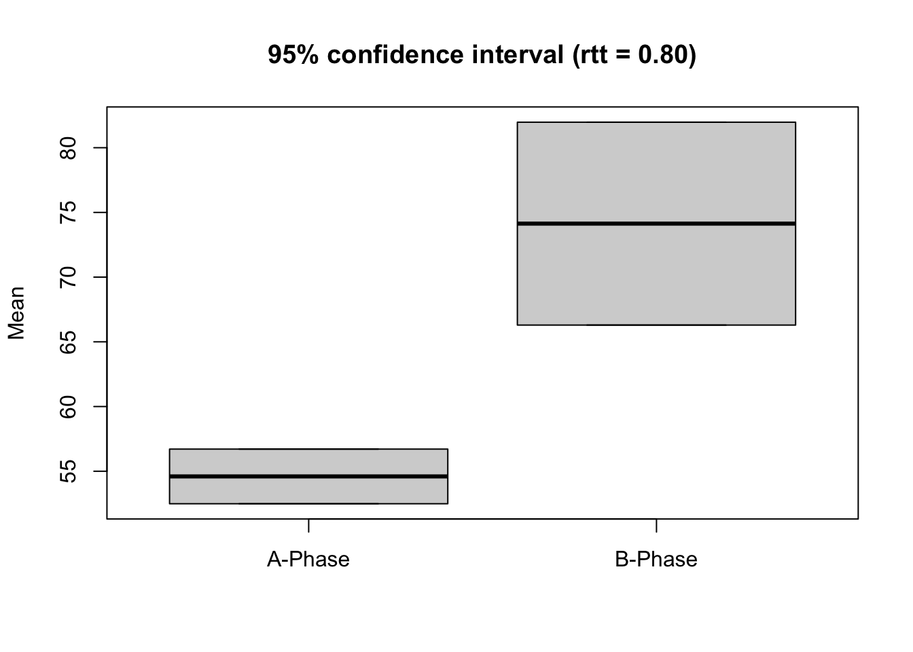

# Overlapping indices


```{=html}
<table>
 <tr>
  <td width="75px" style="background-color:#EEEEEE"></td> 
  <td style="background-color:#EEEEEE"><font face="Courier New" size="2"> overlap(data, dvar, pvar, mvar, decreasing = FALSE, phases = c(1, 2)) </font></td>
 </tr>
</table>  
``` 

`overlap` provides a table with some of the most important overlap indices for each case of an *scdf*. For calculating overlap indicators is is important to know if a decrease or an increase of values is expected between phases. By default `overlap` assumes an increase in values. If the argument `decreasing = TRUE` is set, calculation will be based on the assumption of decreasing values.  


```r
overlap(exampleAB)
```

```
Overlap Indices

Design:  A B 
Comparing phase 1 against phase 2 

             Johanna Karolina   Anja
PND           100.00    86.67  93.33
PEM           100.00   100.00 100.00
PET           100.00    93.33 100.00
NAP           100.00    96.67  98.00
NAP.rescaled  100.00    93.33  96.00
PAND          100.00    90.00  90.00
TAU_U           0.77     0.78   0.64
Base_Tau        0.63     0.59   0.61
Diff_mean      19.53    21.67  20.47
Diff_trend      1.53     0.54   2.50
SMD             8.11     3.17   6.71
Hedges_g        7.77     3.04   6.43
```


Overlap measures refer to a comparison of two phases within a single-case data-set. By default, `overlap` compares a Phase A to a Phase B. The `phases` argument is needed if the phases of the *scdf* do not include phases named A and B or a comparison between other phases in wanted.  
The `phases` argument takes a list with two elements. One element for each of the two phases that should be compared. The elements could contain either the name of the two phases or the number of the position within the *scdf*. If you want to compare the first to the third phase you can set `phases = list(1,3)`. If the phases of your case are named 'A', 'B', and 'C' you could alternatively set `phases = list("A","C")`.  
It is also possible to compare a combination of several cases against a combination of other phases. Each of the two list-elements could contain more than one phase which are concatenated with the `c` command. For example if you have an ABAB-Design and like to compare the two A-phases against the two B-phases `phases = list( c(1,3), c(2,4) )` will do the trick.


```r
overlap(exampleA1B1A2B2, phases = list( c("A1","A2"), c("B1","B2")))
```

```
Overlap Indices

Design:  A1 B1 A2 B2 
Comparing phases 1 + 3 against phases 2 + 4 

              Pawel Moritz Jannis
PND           55.00  77.78  71.43
PEM          100.00 100.00 100.00
PET          100.00 100.00 100.00
NAP           94.50  96.84  98.35
NAP.rescaled  89.00  93.69  96.70
PAND          82.50  85.00  90.00
TAU_U          0.45   0.46   0.38
Base_Tau       0.65   0.68   0.68
Diff_mean     12.25  13.58  15.27
Diff_trend    -0.05   0.00  -0.54
SMD            2.68   3.27   3.62
Hedges_g       2.63   3.21   3.55
```

## Percentage non-overlapping data (PND)


```{=html}
<table>
 <tr>
  <td width="75px" style="background-color:#EEEEEE"></td> 
  <td style="background-color:#EEEEEE"><font face="Courier New" size="2"> pnd(data, dvar, pvar, decreasing = FALSE, phases = c("A", "B")) </font></td>
 </tr>
</table>  
``` 

The percentage of non-overlapping data (PND) effect size measure was described by @scruggs_quantitative_1987 . It is the percentage of all data-points of the second phase of a single-case study exceeding the maximum value of the first phase. In case you have a study where you expect a decrease of values in the  second phase, PND is calculated as the percentage of data-point of the second phase below the minimum of the first phase.  

<div class="figure">

<p class="caption">(\#fig:unnamed-chunk-5)Illustration of PND. PND is 60% as 9 out of 15 datapoints of phase B are higher than the maximum of phase A.</p>
</div>

The function `pnd` provides the PND for each case as well as the mean of all PNDs of that _scdf_. When you expect decreasing values set `decreasing = TRUE`. When there are more than two phases or phases are not named A and B, use the `phases` argument as described at the beginning of this chapter.


```r
pnd(exampleAB)
```

```
Percent Non-Overlapping Data

     Case    PND Total Exceeds
  Johanna   100%    15      15
 Karolina 86.67%    15      13
     Anja 93.33%    15      14

Mean  : 93.33 %
```

## Percentage exceeding the median (PEM)


```{=html}
<table>
 <tr>
  <td width="75px" style="background-color:#EEEEEE"></td> 
  <td style="background-color:#EEEEEE"><font face="Courier New" size="2"> pem(data, dvar, pvar, decreasing = FALSE, binom.test = TRUE, chi.test = FALSE, FUN = median, phases = c(1, 2), ...) </font></td>
 </tr>
</table>  
``` 

The pem function returns the percentage of phase B data exceeding the phase A median. Additionally, a binomial test against a 50/50 distribution is computed. Different measures of central tendency can be addressed for alternative analyses.

<div class="figure">

<p class="caption">(\#fig:unnamed-chunk-8)Illustration of PEM. PEM is 75% as 9 out of 12 datapoints of phase B are higher than the median of phase A.</p>
</div>


```r
pem(exampleAB)
```

```
Percent Exceeding the Median

         PEM positives total binom.p
Johanna  100        15    15       0
Karolina 100        15    15       0
Anja     100        15    15       0

Alternative hypothesis: true probability > 50%
```

## Percentage exceeding the regression trend (PET)


```{=html}
<table>
 <tr>
  <td width="75px" style="background-color:#EEEEEE"></td> 
  <td style="background-color:#EEEEEE"><font face="Courier New" size="2"> pet(data, dvar, pvar, mvar, ci = 0.95, decreasing = FALSE, phases = c(1, 2)) </font></td>
 </tr>
</table>  
``` 

The pet function provides the percentage of phase B data points exceeding the prediction based on the phase A trend. A binomial test against a 50/50 distribution is computed. Furthermore, the percentage of phase B data points exceeding the upper (or lower) 95 percent confidence interval of the predicted progress is computed.


```r
pet(exampleAB)
```

```
Percent Exceeding the Trend

N cases =  3 

             PET binom.p  PET CI
Johanna  100.000       0  86.667
Karolina  93.333       0   0.000
Anja     100.000       0 100.000

Binom.test: alternative hypothesis: true probability > 50%
PET CI: Percent of values greater than upper 95% confidence threshold (greater 1.645*se above predicted value)
```


<div class="figure">

<p class="caption">(\#fig:unnamed-chunk-12)Illustration of PET. PET is 66.7% as 10 out of 15 datapoints of phase B are higher than the projected trend-line of phase A.</p>
</div>

## Percentage of all non-overlapping data (PAND)


```{=html}
<table>
 <tr>
  <td width="75px" style="background-color:#EEEEEE"></td> 
  <td style="background-color:#EEEEEE"><font face="Courier New" size="2"> pand(data, dvar, pvar, decreasing = FALSE, correction = TRUE, phases = c(1, 2)) </font></td>
 </tr>
</table>  
``` 

The `pand` function calculates the percentage of all non-overlapping data [@parker_percentage_2007], an index to quantify a level increase (or decrease) in performance after the onset of an intervention. The argument `correction = TRUE` makes `pand` use a frequency matrix, which is corrected for ties. A tie is counted as the half of a measurement in both phases. Set `correction = FALSE` to use the uncorrected matrix, which is not recommended.


```r
pand(exampleAB)
```

```
Percentage of all non-overlapping data

PAND =  93.3 %
Φ =  0.822  ; Φ² =  0.676 

Number of Cases: 3 
Total measurements: 60  (in phase A: 15; in phase B: 45)
n overlapping data per case: 0, 2, 2
Total overlapping data: n = 4 ; percentage = 6.7 

2 x 2 Matrix of proportions
	% expected
	A	B	total
%    A	21.7	3.3	25
real B	3.3	71.7	75
 total	25	75

2 x 2 Matrix of counts
	expected
	A	B	total
     A	13	2	15
real B	2	43	45
 total	15	45


Note. Matrix is corrected for ties

Correlation based analysis:

z = 6.316, p = 0.000, τ = 0.822 
```

PAND indicates nonoverlap between phase A and B data (like PND), but uses all data and is therefore not based on one single (probably unrepresentative) datapoint. Furthermore, PAND allows the comparison of real and expected associations (Chi-square test) and estimation of the effect size Phi, which equals Pearsons r for dichotomous data. Thus, phi-Square is the amount of explained variance. The original procedure for computing PAND does not account for ambivalent datapoints (ties). The newer NAP overcomes this problem and has better precision-power [@parker_effect_2011].

## Nonoverlap of all pairs (NAP)


```{=html}
<table>
 <tr>
  <td width="75px" style="background-color:#EEEEEE"></td> 
  <td style="background-color:#EEEEEE"><font face="Courier New" size="2"> nap(data, dvar, pvar, decreasing = FALSE, phases = c(1, 2)) </font></td>
 </tr>
</table>  
``` 

The `nap` function calculates the nonoverlap of all pairs [@parker_improved_2009]. NAP summarizes the overlap between all pairs of phase A and phase B data points. If an increase of phase B scores is expected, a non-overlapping pair has a higher phase B data point. The NAP equals number of pairs showing no overlap / number of pairs. Because NAP can only take values between 50 and 100 percent, a rescaled and therefore more intuitive NAP (0-100%) is also displayed. NAP is equivalent to the the U-test and Wilcox rank sum test. Thus, a Wilcox test is conducted and reported for each case. 


```r
nap(exampleAB)
```

```
Nonoverlap of All Pairs

     Case NAP Rescaled Pairs Positives Ties   W       p
  Johanna 100      100    75        75    0 0.0 0.00062
 Karolina  97       93    75        72    1 2.5 0.00129
     Anja  98       96    75        73    1 1.5 0.00095
```

## Tau-U


```{=html}
<table>
 <tr>
  <td width="75px" style="background-color:#EEEEEE"></td> 
  <td style="background-color:#EEEEEE"><font face="Courier New" size="2"> tau_u(data, dvar, pvar, tau_method = "b", method = "complete", phases = c(1, 2), meta_method = "random", continuity_correction = FALSE) </font></td>
 </tr>
</table>  
``` 

The `tau_u` function takes a _scdf_ and returns Tau-U calculations for each single-case within that file. Additionally, an overall Tau-U value is calculated for all cases. The overall Tau-U value is the average of all Tau-U values weighted by their standard error. This procedure has been proposed by @parker_combining_2011.  
The `tau_u` function provides two methods for calculation of Tau-U. By setting the argument `method = "parker"`, Tau-U is calculated as described in @parker_combining_2011. This procedure could lead to Tau-U values above 1 and below -1 which are difficult to interpret. `method = "complete`, which is the default, applies a correction that keeps the values within the -1 to 1 range and should be more appropriate.  
In the method proposed by @parker_combining_2011 data of the same value (ties) are ignored and treated as if these data had not been available. Alternatively, ties might be considered in favor of the intervention or not. For the latter, the `ties.method` argument could be set to `ties.method = "positive"` or  `ties.method = "negative"`. The default is `"omit"` following @parker_combining_2011.  
The standard return of the `tau_u` function does not display all calculations. If you like to have more details, apply the `print` function with the additional argument `complete = TRUE`.


```r
dat <- scdf(c(2,0,1,4,3,5,9,7,8), phase.design = c(A = 4, B = 5))
res <- tau_u(dat)
print(res, complete = TRUE)
```

```
Tau-U
Method: complete 
Applied Kendall's Tau-b

Case: Case1 
                            pairs pos neg ties  S    D   Tau SD_S VAR_S SE_Tau
A vs. B                        20  19   1    0 18 20.0 0.900 8.16 66.67  0.408
Trend A                         6   4   2    0  2  6.0 0.333 2.94  8.67  0.491
Trend B                        10   8   2    0  6 10.0 0.600 4.08 16.67  0.408
A vs. B - Trend A              26  21   5    0 16 30.6 0.523 8.68 75.33  0.284
A vs. B + Trend B              30  27   3    0 24 32.9 0.730 9.13 83.33  0.278
A vs. B + Trend B - Trend A    36  29   7    0 22 36.0 0.611 9.59 92.00  0.266
                                Z       p
A vs. B                     2.205 0.02749
Trend A                     0.679 0.49691
Trend B                     1.470 0.14164
A vs. B - Trend A           1.843 0.06527
A vs. B + Trend B           2.629 0.00856
A vs. B + Trend B - Trend A 2.294 0.02181
```


```r
tau_u(exampleAB)
```

```
Tau-U
Method: complete 
Applied Kendall's Tau-b

Overall Tau-U: 
                       Model Tau_U     se    z        p
                     A vs. B 0.969 0.1772 5.47 4.54e-08
           A vs. B - Trend A 0.590 0.1064 5.54 3.04e-08
           A vs. B + Trend B 0.740 0.0960 7.71 1.29e-14
 A vs. B + Trend B - Trend A 0.731 0.0942 7.75 9.09e-15

Case: Johanna 
                              Tau SE_Tau    Z     p
A vs. B                     1.000  0.306 3.27 0.001
A vs. B - Trend A           0.592  0.184 3.22 0.001
A vs. B + Trend B           0.786  0.166 4.75 0.000
A vs. B + Trend B - Trend A 0.765  0.163 4.71 0.000

Case: Karolina 
                              Tau SE_Tau    Z     p
A vs. B                     0.940  0.308 3.06 0.002
A vs. B - Trend A           0.554  0.184 3.01 0.003
A vs. B + Trend B           0.805  0.166 4.85 0.000
A vs. B + Trend B - Trend A 0.783  0.163 4.81 0.000

Case: Anja 
                              Tau SE_Tau    Z     p
A vs. B                     0.966  0.308 3.14 0.002
A vs. B - Trend A           0.624  0.186 3.36 0.001
A vs. B + Trend B           0.626  0.167 3.74 0.000
A vs. B + Trend B - Trend A 0.642  0.164 3.91 0.000
```

## Reliable change index


```{=html}
<table>
 <tr>
  <td width="75px" style="background-color:#EEEEEE"></td> 
  <td style="background-color:#EEEEEE"><font face="Courier New" size="2"> rci(data, dvar, pvar, rel, ci = 0.95, graph = FALSE, phases = c(1, 2)) </font></td>
 </tr>
</table>  
``` 

Basically, the reliable change index (rci) depicts if a post-test is above a pre-test value. Based on the reliability of the measurements and the standard-deviation the standard error is calculated. The mean difference between phase-A and phase-B is divided by the standard-error. Several authors proposed refined methods for calculating the rci. 

The `rci` function computes three indices of reliable change [@wise_methods_2004] and corresponding descriptive statistics.


```r
rci(exampleAB$Johanna, rel = 0.8, graph = TRUE)
```



```
Reliable Change Index

Mean Difference =  19.53333 
Standardized Difference =  1.678301 

Descriptives:
         n     mean       SD       SE
A-Phase  5 54.60000 2.408319 1.077033
B-Phase 15 74.13333 8.943207 3.999524

Reliability =  0.8 

95 % Confidence Intervals:
           Lower    Upper
A-Phase 52.48905 56.71095
B-Phase 66.29441 81.97226

Reliable Change Indices:
                             RCI
Jacobson et al.         18.13624
Christensen and Mendoza 12.82426
Hageman and Arrindell   18.49426
```

