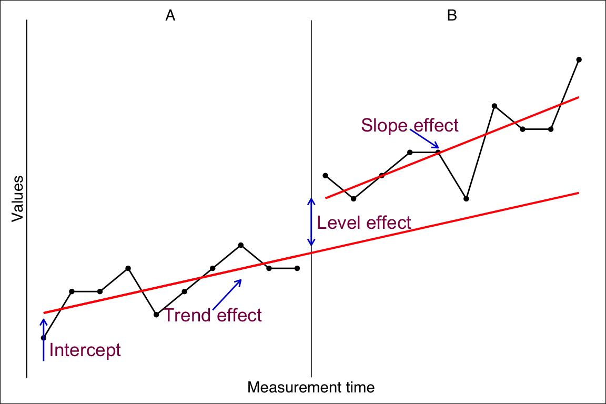

# Piecewise linear regressions

In a piecewise regression analysis (sometimes called segmented regression) a data-set is split at a specific break point and regression parameters (intercept and slopes) are calculated separately for data before and after the break point. This is done because we assume that at the break point a qualitative change happens affecting intercept and slope. This approach lends itself perfectly to analyze single-case data which are from a statistical point of view time-series data segmented into phases. A general model for single-case data based on the piecewise regression approach has been suggested by Huitema and McKean @huitema_design_2000. They refer to two-phase single-case designs with a pre-intervention phase containing some measurements before the start of the intervention (A-phase) and an intervention phase containing measurements beginning at the intervention's start and lasting throughout the intervention (B-phase).

In this model, four parameters predict the outcome at a specific measurement point:

1.  The performance at the beginning of the study (**intercept**),

2.  a developmental effect leading to a continuous increase throughout all measurements (**trend effect**),

3.  an intervention effect leading to an immediate and constant increase in performance (l**evel effect**), and

4.  a second intervention effect that evolves continuously with the beginning of the intervention (**slope effect**).



*scan* provides an implementation based on this piecewise regression approach. Though the original model is extended by several factors:

-   multiple phase designs
-   additional (control) variables
-   autoregression modeling
-   logistic, binomial, and poisson distributed dependent variables and error terms
-   multivariate analyzes for analyzing the effect of an intervention on more than one outcome variable.

## The basic plm function


```{=html}
<table>
 <tr>
  <td width="75px" style="background-color:#EEEEEE"></td> 
  <td style="background-color:#EEEEEE"><font face="Courier New" size="2"> plm(data, dvar, pvar, mvar, AR = 0, model = "B&L-B", family = "gaussian", trend = TRUE, level = TRUE, slope = TRUE, formula = NULL, update = NULL, na.action = na.omit, ...) </font></td>
 </tr>
</table>  
``` 

The basic function for applying a regression analyzes to a single-case dataset is `plm`. This function analyzes one single-case. In its simplest way, `plm` takes one argument with an *scdf* object and it returns a full piecewise regression analyzes.


```r
plm(exampleAB$Johanna)
```

```
Piecewise Regression Analysis

Dummy model:  B&L-B 

Fitted a gaussian distribution.
F(3, 16) = 28.69; p = 0.000; R² = 0.843; Adjusted R² = 0.814

                   B   2.5%  97.5%    SE      t     p delta R²
Intercept     54.300 43.978 64.622 5.267 10.310 0.000         
Trend mt       0.100 -3.012  3.212 1.588  0.063 0.951   0.0000
Level phase B  6.333 -2.979 15.646 4.751  1.333 0.201   0.0174
Slope phase B  1.525 -1.642  4.692 1.616  0.944 0.359   0.0087

Autocorrelations of the residuals
 lag    cr
   1 -0.32
   2 -0.13
   3 -0.01

Formula: values ~ 1 + mt + phaseB + interB
```

### Dummy model

The `model` argument is used to code the *dummy variable*. This *dummy variable* is used to compute the slope and level effects of the *phase* variable.\
The *phase* variable is categorical, identifying the phase of each measurement. Typically, categorical variables are implemented by means of dummy variables. In a piecewise regression model two phase effects have to be estimated: a level effect and a slope effect. The level effect is implemented quite straight forward: for each phase beginning with the second phase a new dummy variable is created with values of zero for all measurements except the measurements of the phase in focus where values of one are set.

<table>
 <thead>
  <tr>
   <th style="text-align:left;"> phase </th>
   <th style="text-align:right;"> values </th>
   <th style="text-align:right;"> level_B </th>
  </tr>
 </thead>
<tbody>
  <tr>
   <td style="text-align:left;"> A </td>
   <td style="text-align:right;"> 3 </td>
   <td style="text-align:right;"> 0 </td>
  </tr>
  <tr>
   <td style="text-align:left;"> A </td>
   <td style="text-align:right;"> 6 </td>
   <td style="text-align:right;"> 0 </td>
  </tr>
  <tr>
   <td style="text-align:left;"> A </td>
   <td style="text-align:right;"> 4 </td>
   <td style="text-align:right;"> 0 </td>
  </tr>
  <tr>
   <td style="text-align:left;"> A </td>
   <td style="text-align:right;"> 7 </td>
   <td style="text-align:right;"> 0 </td>
  </tr>
  <tr>
   <td style="text-align:left;"> B </td>
   <td style="text-align:right;"> 5 </td>
   <td style="text-align:right;"> 1 </td>
  </tr>
  <tr>
   <td style="text-align:left;"> B </td>
   <td style="text-align:right;"> 3 </td>
   <td style="text-align:right;"> 1 </td>
  </tr>
  <tr>
   <td style="text-align:left;"> B </td>
   <td style="text-align:right;"> 4 </td>
   <td style="text-align:right;"> 1 </td>
  </tr>
  <tr>
   <td style="text-align:left;"> B </td>
   <td style="text-align:right;"> 6 </td>
   <td style="text-align:right;"> 1 </td>
  </tr>
  <tr>
   <td style="text-align:left;"> B </td>
   <td style="text-align:right;"> 3 </td>
   <td style="text-align:right;"> 1 </td>
  </tr>
</tbody>
</table>

For estimating the *slope effect* of each phase, another kind of dummy variables have to be created. Like the dummy variables for level effects the values are set to zero for all measurements except the ones of the phase in focus. Here, values start to increase with every measurement until the end of the phase.\
Various suggestions have been made regarding the way in which these values increase. The *B&L-B* model starts with a one at the first measurement of the phase and increases with every measurement while the *H-M* model starts with a zero.

<table>
 <thead>
  <tr>
   <th style="text-align:left;"> phase </th>
   <th style="text-align:right;"> values </th>
   <th style="text-align:right;"> level </th>
   <th style="text-align:right;"> slope B&amp;L-M </th>
   <th style="text-align:right;"> slope H-M </th>
  </tr>
 </thead>
<tbody>
  <tr>
   <td style="text-align:left;"> A </td>
   <td style="text-align:right;"> 3 </td>
   <td style="text-align:right;"> 0 </td>
   <td style="text-align:right;"> 0 </td>
   <td style="text-align:right;"> 0 </td>
  </tr>
  <tr>
   <td style="text-align:left;"> A </td>
   <td style="text-align:right;"> 6 </td>
   <td style="text-align:right;"> 0 </td>
   <td style="text-align:right;"> 0 </td>
   <td style="text-align:right;"> 0 </td>
  </tr>
  <tr>
   <td style="text-align:left;"> A </td>
   <td style="text-align:right;"> 4 </td>
   <td style="text-align:right;"> 0 </td>
   <td style="text-align:right;"> 0 </td>
   <td style="text-align:right;"> 0 </td>
  </tr>
  <tr>
   <td style="text-align:left;"> A </td>
   <td style="text-align:right;"> 7 </td>
   <td style="text-align:right;"> 0 </td>
   <td style="text-align:right;"> 0 </td>
   <td style="text-align:right;"> 0 </td>
  </tr>
  <tr>
   <td style="text-align:left;"> B </td>
   <td style="text-align:right;"> 5 </td>
   <td style="text-align:right;"> 1 </td>
   <td style="text-align:right;"> 1 </td>
   <td style="text-align:right;"> 0 </td>
  </tr>
  <tr>
   <td style="text-align:left;"> B </td>
   <td style="text-align:right;"> 3 </td>
   <td style="text-align:right;"> 1 </td>
   <td style="text-align:right;"> 2 </td>
   <td style="text-align:right;"> 1 </td>
  </tr>
  <tr>
   <td style="text-align:left;"> B </td>
   <td style="text-align:right;"> 4 </td>
   <td style="text-align:right;"> 1 </td>
   <td style="text-align:right;"> 3 </td>
   <td style="text-align:right;"> 2 </td>
  </tr>
  <tr>
   <td style="text-align:left;"> B </td>
   <td style="text-align:right;"> 6 </td>
   <td style="text-align:right;"> 1 </td>
   <td style="text-align:right;"> 4 </td>
   <td style="text-align:right;"> 3 </td>
  </tr>
  <tr>
   <td style="text-align:left;"> B </td>
   <td style="text-align:right;"> 3 </td>
   <td style="text-align:right;"> 1 </td>
   <td style="text-align:right;"> 5 </td>
   <td style="text-align:right;"> 4 </td>
  </tr>
</tbody>
</table>

With single-case studies with more than two phases it gets a bit more complicated. Applying the a fore described models to three phases would result in a comparison of each phase to the first phase (usually the A Phase). That is, regression weights and significance tests will depict differences of each phase to the values of phase A. This might be OK depending on what you are interested in. But in a lot of cases we are more interested in analyzing the effects of a phase compared to the previous one.\
This is achieved applying the *JW* dummy model. In this model, the dummy variable for the level effect is set to zero for all phases preceding the phase in focus and set to one for all remaining measurements. Similar, the dummy variable for the slope effect is set to zero for all phases preceding the one in focus and starts with one for the first measurement of the target phase and increases until the last measurement of the case.

<table>
 <thead>
  <tr>
   <th style="text-align:left;"> phase </th>
   <th style="text-align:right;"> values </th>
   <th style="text-align:right;"> level_B </th>
   <th style="text-align:right;"> level_C </th>
   <th style="text-align:right;"> slope_B </th>
   <th style="text-align:right;"> slope_C </th>
  </tr>
 </thead>
<tbody>
  <tr>
   <td style="text-align:left;"> A </td>
   <td style="text-align:right;"> 3 </td>
   <td style="text-align:right;"> 0 </td>
   <td style="text-align:right;"> 0 </td>
   <td style="text-align:right;"> 0 </td>
   <td style="text-align:right;"> 0 </td>
  </tr>
  <tr>
   <td style="text-align:left;"> A </td>
   <td style="text-align:right;"> 6 </td>
   <td style="text-align:right;"> 0 </td>
   <td style="text-align:right;"> 0 </td>
   <td style="text-align:right;"> 0 </td>
   <td style="text-align:right;"> 0 </td>
  </tr>
  <tr>
   <td style="text-align:left;"> A </td>
   <td style="text-align:right;"> 4 </td>
   <td style="text-align:right;"> 0 </td>
   <td style="text-align:right;"> 0 </td>
   <td style="text-align:right;"> 0 </td>
   <td style="text-align:right;"> 0 </td>
  </tr>
  <tr>
   <td style="text-align:left;"> A </td>
   <td style="text-align:right;"> 7 </td>
   <td style="text-align:right;"> 0 </td>
   <td style="text-align:right;"> 0 </td>
   <td style="text-align:right;"> 0 </td>
   <td style="text-align:right;"> 0 </td>
  </tr>
  <tr>
   <td style="text-align:left;"> B </td>
   <td style="text-align:right;"> 5 </td>
   <td style="text-align:right;"> 1 </td>
   <td style="text-align:right;"> 0 </td>
   <td style="text-align:right;"> 1 </td>
   <td style="text-align:right;"> 0 </td>
  </tr>
  <tr>
   <td style="text-align:left;"> B </td>
   <td style="text-align:right;"> 3 </td>
   <td style="text-align:right;"> 1 </td>
   <td style="text-align:right;"> 0 </td>
   <td style="text-align:right;"> 2 </td>
   <td style="text-align:right;"> 0 </td>
  </tr>
  <tr>
   <td style="text-align:left;"> B </td>
   <td style="text-align:right;"> 4 </td>
   <td style="text-align:right;"> 1 </td>
   <td style="text-align:right;"> 0 </td>
   <td style="text-align:right;"> 3 </td>
   <td style="text-align:right;"> 0 </td>
  </tr>
  <tr>
   <td style="text-align:left;"> B </td>
   <td style="text-align:right;"> 6 </td>
   <td style="text-align:right;"> 1 </td>
   <td style="text-align:right;"> 0 </td>
   <td style="text-align:right;"> 4 </td>
   <td style="text-align:right;"> 0 </td>
  </tr>
  <tr>
   <td style="text-align:left;"> B </td>
   <td style="text-align:right;"> 3 </td>
   <td style="text-align:right;"> 1 </td>
   <td style="text-align:right;"> 0 </td>
   <td style="text-align:right;"> 5 </td>
   <td style="text-align:right;"> 0 </td>
  </tr>
  <tr>
   <td style="text-align:left;"> C </td>
   <td style="text-align:right;"> 7 </td>
   <td style="text-align:right;"> 1 </td>
   <td style="text-align:right;"> 1 </td>
   <td style="text-align:right;"> 6 </td>
   <td style="text-align:right;"> 1 </td>
  </tr>
  <tr>
   <td style="text-align:left;"> C </td>
   <td style="text-align:right;"> 5 </td>
   <td style="text-align:right;"> 1 </td>
   <td style="text-align:right;"> 1 </td>
   <td style="text-align:right;"> 7 </td>
   <td style="text-align:right;"> 2 </td>
  </tr>
  <tr>
   <td style="text-align:left;"> C </td>
   <td style="text-align:right;"> 6 </td>
   <td style="text-align:right;"> 1 </td>
   <td style="text-align:right;"> 1 </td>
   <td style="text-align:right;"> 8 </td>
   <td style="text-align:right;"> 3 </td>
  </tr>
  <tr>
   <td style="text-align:left;"> C </td>
   <td style="text-align:right;"> 4 </td>
   <td style="text-align:right;"> 1 </td>
   <td style="text-align:right;"> 1 </td>
   <td style="text-align:right;"> 9 </td>
   <td style="text-align:right;"> 4 </td>
  </tr>
  <tr>
   <td style="text-align:left;"> C </td>
   <td style="text-align:right;"> 8 </td>
   <td style="text-align:right;"> 1 </td>
   <td style="text-align:right;"> 1 </td>
   <td style="text-align:right;"> 10 </td>
   <td style="text-align:right;"> 5 </td>
  </tr>
</tbody>
</table>

### Adjusting the model


```r
example <- scdf(
   values = c(55, 58, 53, 50, 52, 55, 68, 68, 81, 67, 78, 73, 72, 78, 81, 78, 71, 85, 80, 76),
   phase.design = c(A = 5, B = 15)
)

plm(example)
```

```
Piecewise Regression Analysis

Dummy model:  B&L-B 

Fitted a gaussian distribution.
F(3, 16) = 21.36; p = 0.000; R² = 0.800; Adjusted R² = 0.763

                   B   2.5%  97.5%    SE      t     p delta R²
Intercept     57.800 46.521 69.079 5.755 10.044 0.000         
Trend mt      -1.400 -4.801  2.001 1.735 -0.807 0.432   0.0081
Level phase B 14.467  4.291 24.642 5.192  2.786 0.013   0.0970
Slope phase B  2.500 -0.961  5.961 1.766  1.416 0.176   0.0250

Autocorrelations of the residuals
 lag    cr
   1 -0.28
   2  0.05
   3 -0.11

Formula: values ~ 1 + mt + phaseB + interB
```

The piecewise regression reveals a significant level effect and two non significant effects for trend and slope. In a further analyses we would like to put the slope effect out of the equation. There are several ways to do this. The easiest way is the to unset the `slope` argument: `slope = FALSE`.


```r
plm(example, slope = FALSE)
```

```
Piecewise Regression Analysis

Dummy model:  B&L-B 

Fitted a gaussian distribution.
F(2, 17) = 29.30; p = 0.000; R² = 0.775; Adjusted R² = 0.749

                   B   2.5%  97.5%    SE      t     p delta R²
Intercept     50.559 45.239 55.878 2.714 18.627 0.000         
Trend mt       1.014  0.364  1.664 0.332  3.057 0.007   0.1236
Level phase B 10.329  1.674 18.983 4.416  2.339 0.032   0.0724

Autocorrelations of the residuals
 lag    cr
   1 -0.07
   2  0.06
   3 -0.17

Formula: values ~ 1 + mt + phaseB
```

In the resulting estimations the trend and level effects are now significant. The model estimated a trend effect of 1.01 points per measurement time and a level effect of 2.46 points. That is, with the beginning of the intervention (the B-phase) the score increases by 15.38 points (5 x 1.01 + 10.33).

### Adding additional predictors

In more complex analyses additional predictors can be included in the piecewise regression model.

To do this, we have to change the regression formula 'manually' by applying the `update` argument. The `update` argument allows to change the underlying regression formula. To add a new variable named for example `newVar`, set `update = .~. + newVar`. The `.~.` part takes the internally build formula and `+ newVar` adds a variable named `newVar` to the equation.


```r
plm(exampleAB_add, update = .~. + cigarrets)
```

```
Piecewise Regression Analysis

Dummy model:  B&L-B 

Fitted a gaussian distribution.
F(4, 35) = 5.87; p = 0.001; R² = 0.402; Adjusted R² = 0.333

                            B   2.5%  97.5%    SE      t     p delta R²
Intercept              48.579 42.539 54.618 3.081 15.765 0.000         
Trend day               0.392 -0.221  1.005 0.313  1.253 0.218   0.0269
Level phase Medication  3.753 -2.815 10.321 3.351  1.120 0.270   0.0214
Slope phase Medication -0.294 -0.972  0.384 0.346 -0.850 0.401   0.0124
cigarrets              -0.221 -1.197  0.755 0.498 -0.443 0.660   0.0034

Autocorrelations of the residuals
 lag    cr
   1  0.20
   2 -0.19
   3 -0.16

Formula: wellbeing ~ day + phaseMedication + interMedication + cigarrets
```

The formula has two parts divided by a tilde. Left of the tilde is the variable to be predicted and right of it the predictors. A `1` indicates the intercept, the variable `mt` estimates the trend effect, `phaseB` the level effect of the B-phase and the variable `interB` the slope effect of the B-phase. If `formula` is not explicitly defined it is set to `formula = values ~ 1 + mt + phaseB + interB` (assuming an AB-design) to estimate the full piecewise regression model.

### [to be written] Modelling autoregression


```r
autocorr(Grosche2011)
```

```
Autocorrelations

  case phase lag_1 lag_2 lag_3
   Eva     A -0.04 -0.56 -0.01
   Eva     B  0.46  0.10  0.16
   Eva   all  0.48  0.13  0.24
 Georg     A  0.51 -0.01 -0.13
 Georg     B -0.01 -0.02 -0.14
 Georg   all  0.40  0.15 -0.12
  Olaf     A  0.64  0.29 -0.24
  Olaf     B -0.45 -0.20  0.16
  Olaf   all  0.35  0.12 -0.09
```

## [to be written] Multivariate piecewise regression


```{=html}
<table>
 <tr>
  <td width="75px" style="background-color:#EEEEEE"></td> 
  <td style="background-color:#EEEEEE"><font face="Courier New" size="2"> mplm(data, dvar, mvar, pvar, model = "B&L-B", trend = TRUE, level = TRUE, slope = TRUE, formula = NULL, update = NULL, na.action = na.omit, ...) </font></td>
 </tr>
</table>  
``` 


```r
mplm(exampleAB_add, dvar = c("wellbeing", "depression"))
```

```
Registered S3 methods overwritten by 'car':
  method                          from
  influence.merMod                lme4
  cooks.distance.influence.merMod lme4
  dfbeta.influence.merMod         lme4
  dfbetas.influence.merMod        lme4
```

```
Multivariate piecewise linear model

Dummy model: B&L-B 

Coefficients: 
                        wellbeing depression
(Intercept)            48.0380952  4.0857143
day                     0.3785714  0.1142857
Level Phase Medication  3.8633333 -0.7800000
Slope Phase Medication -0.2754945 -0.1650549

Formula: y ~ 1 + day + phaseMedication + interMedication

Type III MANOVA Tests: Pillai test statistic
                       Df test stat approx F num Df den Df Pr(>F)    
(Intercept)             1   0.89679  152.053      2     35 <2e-16 ***
day                     1   0.05450    1.009      2     35 0.3750    
Level Phase Medication  1   0.03846    0.700      2     35 0.5034    
Slope Phase Medication  1   0.03911    0.712      2     35 0.4975    
---
Signif. codes:  0 '***' 0.001 '**' 0.01 '*' 0.05 '.' 0.1 ' ' 1
```

## Multilevel plm analyses


```{=html}
<table>
 <tr>
  <td width="75px" style="background-color:#EEEEEE"></td> 
  <td style="background-color:#EEEEEE"><font face="Courier New" size="2"> hplm(data, dvar, pvar, mvar, model = "B&L-B", method = "ML", control = list(opt = "optim"), random.slopes = FALSE, lr.test = FALSE, ICC = TRUE, trend = TRUE, level = TRUE, slope = TRUE, fixed = NULL, random = NULL, update.fixed = NULL, data.l2 = NULL, ...) </font></td>
 </tr>
</table>  
``` 

Multilevel analyses can take the piecewise-regression approach even further. It allows for

-   analyzing the effects between phases for multiple single-cases at once
-   describing variability between subjects regarding these effects, and
-   introducing variables and factors for explaining the differences.

The basic function for applying a multilevel piecewise regression analysis is `hplm`. The `hplm` function is similar to the `plm` function, so I recommend that you get familar with `plm` before applying an `hplm`.

Here is a simple example:


```r
hplm(exampleAB_50)
```

```
Hierarchical Piecewise Linear Regression

Estimation method ML 
Slope estimation method: B&L-B 
50 Cases

ICC = 0.195; L = 192.0; p = 0.000

Fixed effects (values ~ 1 + mt + phaseB + interB)

                   B    SE   df      t p
Intercept     51.614 1.282 1281 40.274 0
Trend mt       0.671 0.115 1281  5.844 0
Level phase B 12.938 0.590 1281 21.942 0
Slope phase B  0.859 0.119 1281  7.236 0

Random effects (~1 | case)

          EstimateSD
Intercept      8.179
Residual       5.335
```

Here is an example inlcuding random slopes:


```r
hplm(exampleAB_50, random.slopes = TRUE)
```

```
Hierarchical Piecewise Linear Regression

Estimation method ML 
Slope estimation method: B&L-B 
50 Cases

ICC = 0.195; L = 192.0; p = 0.000

Fixed effects (values ~ 1 + mt + phaseB + interB)

                   B    SE   df      t p
Intercept     51.720 1.348 1281 38.378 0
Trend mt       0.637 0.125 1281  5.080 0
Level phase B 13.090 0.762 1281 17.176 0
Slope phase B  0.887 0.129 1281  6.856 0

Random effects (~1 + mt + phaseB + interB | case)

              EstimateSD
Intercept          8.691
Trend mt           0.343
Level phase B      3.654
Slope phase B      0.358
Residual           4.994
```

### Adding additional L2-variables

In some analyses researchers want to investigate whether attributes of the individuals contribute to the effectiveness of an intervention. For example might an intervention on mathematical abilities be less effective for student with a migration background due to too much language related material within the training. Such analyses can also be conducted with *scan*. Therefore, we need to define a new *data frame* including the relevant information of the subjects of the single-case studies we want to analyze. This *data frame* consists of a variable labeled `case` which has to correspond to the case names of the *scfd* and further variables with attributes of the subjects. To build a *data frame* we can use the R function `data.frame`.


```r
L2 <- data.frame(
  case = c("Antonia","Theresa", "Charlotte", "Luis", "Bennett", "Marie"), 
  age = c(16, 13, 13, 10, 5, 14), 
  sex = c("f","f","f","m","m","f")
)
L2
```

```
       case age sex
1   Antonia  16   f
2   Theresa  13   f
3 Charlotte  13   f
4      Luis  10   m
5   Bennett   5   m
6     Marie  14   f
```

Multilevel analyses require a high number of Level 2 units. The exact number depends on the complexity of the analyses, the size of the effects, the number of level 1 units, and the variability of the residuals. But surely we need at least about 30 level 2 units. In a single-case design that is, we need at least 30 single-cases (subjects) within the study. After setting the level 2 data frame we use the `data.l2` argument of the `hplm` function to include it into the analysis. Then we have to specify the regression function using the `update.fixed` argument. The level 2 variables can be added just like any other additional variable. For example, we have added a level 2 data-set with the two variables `sex` and `age`. `update` could be construed of the level 1 piecewise regression model `.~.` plus the additional level 2 variables of interest `+ sex + age`. The complete argument is `update.fixed = .~. + sex + age`. This analyses will estimate a main effect of sex and age on the overall performance. In case we want to analyze an interaction between the intervention effects and for example the sex of the subject we have to add an additional interaction term (a cross-level interaction). An interaction is defined with a colon. So `sex:phase` indicates an interaction of sex and the level effect in the single case study. The complete formula now is `update.fixed = .~. + sex + age + sex:phase`.

*scan* includes an example single-case study with 50 subjects `example50` and an additional level 2 data-set `example50.l2`. Here are the first 10 cases of `example50.l2`.

<table>
 <thead>
  <tr>
   <th style="text-align:left;"> case </th>
   <th style="text-align:left;"> sex </th>
   <th style="text-align:right;"> age </th>
  </tr>
 </thead>
<tbody>
  <tr>
   <td style="text-align:left;"> Jeremiah </td>
   <td style="text-align:left;"> m </td>
   <td style="text-align:right;"> 10 </td>
  </tr>
  <tr>
   <td style="text-align:left;"> Leon </td>
   <td style="text-align:left;"> m </td>
   <td style="text-align:right;"> 12 </td>
  </tr>
  <tr>
   <td style="text-align:left;"> Pablo </td>
   <td style="text-align:left;"> m </td>
   <td style="text-align:right;"> 10 </td>
  </tr>
  <tr>
   <td style="text-align:left;"> Jamal </td>
   <td style="text-align:left;"> m </td>
   <td style="text-align:right;"> 10 </td>
  </tr>
  <tr>
   <td style="text-align:left;"> Giovanny </td>
   <td style="text-align:left;"> m </td>
   <td style="text-align:right;"> 11 </td>
  </tr>
  <tr>
   <td style="text-align:left;"> Callum </td>
   <td style="text-align:left;"> m </td>
   <td style="text-align:right;"> 10 </td>
  </tr>
  <tr>
   <td style="text-align:left;"> Dwayne </td>
   <td style="text-align:left;"> m </td>
   <td style="text-align:right;"> 11 </td>
  </tr>
  <tr>
   <td style="text-align:left;"> Neymar </td>
   <td style="text-align:left;"> m </td>
   <td style="text-align:right;"> 10 </td>
  </tr>
  <tr>
   <td style="text-align:left;"> Krish </td>
   <td style="text-align:left;"> m </td>
   <td style="text-align:right;"> 11 </td>
  </tr>
  <tr>
   <td style="text-align:left;"> Caiden </td>
   <td style="text-align:left;"> m </td>
   <td style="text-align:right;"> 12 </td>
  </tr>
</tbody>
</table>

Analyzing the data with `hplm` could look like this:


```r
hplm(exampleAB_50, data.l2 = exampleAB_50.l2, update.fixed = .~. + sex + age)
```

```
Hierarchical Piecewise Linear Regression

Estimation method ML 
Slope estimation method: B&L-B 
50 Cases

ICC = 0.195; L = 192.0; p = 0.000

Fixed effects (values ~ mt + phaseB + interB + sex + age)

                   B     SE   df      t     p
Intercept     71.464 13.076 1281  5.465 0.000
Trend mt       0.667  0.115 1281  5.808 0.000
Level phase B 12.951  0.590 1281 21.951 0.000
Slope phase B  0.863  0.119 1281  7.264 0.000
sexm          -2.130  2.336   47 -0.912 0.367
age           -1.710  1.157   47 -1.478 0.146

Random effects (~1 | case)

          EstimateSD
Intercept      7.975
Residual       5.335
```

`sex` is a factor with the levels `f` and `m`. So `sexm` is the effect of being male on the overall performance. `age` does not seem to have any effect. So we drop `age` out of the equation and add an interaction of sex and phase to see whether the `sex` effect is due to a weaker impact of the intervention on males.


```r
hplm(exampleAB_50, data.l2 = exampleAB_50.l2, update.fixed = .~. + sex + sex:phaseB)
```

```
Hierarchical Piecewise Linear Regression

Estimation method ML 
Slope estimation method: B&L-B 
50 Cases

ICC = 0.195; L = 192.0; p = 0.000

Fixed effects (values ~ mt + phaseB + interB + sex + phaseB:sex)

                        B    SE   df       t     p
Intercept          49.801 1.735 1280  28.711 0.000
Trend mt            0.638 0.109 1280   5.847 0.000
Level phase B      16.762 0.644 1280  26.034 0.000
Slope phase B       0.889 0.113 1280   7.884 0.000
sexm                3.983 2.368   48   1.682 0.099
Level phase B:sexm -7.463 0.622 1280 -11.994 0.000

Random effects (~1 | case)

          EstimateSD
Intercept      8.144
Residual       5.059
```


Now the interaction `phase:sexm` is significant and the main effect is no longer relevant. It looks like the intervention effect is 7.5 points lower for male subjects. While the level-effect is 16.8 points for female subjects it is 16.8 - 7.5 = 9.3 for males.
