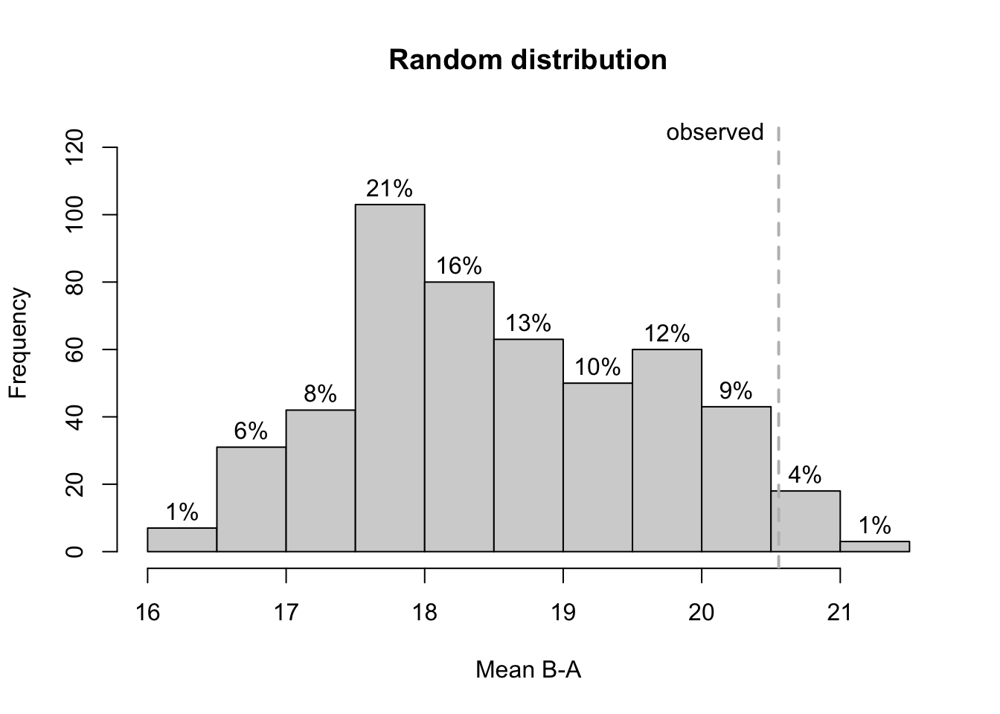

# Randomization tests


```{=html}
<table>
 <tr>
  <td width="75px" style="background-color:#EEEEEE"></td> 
  <td style="background-color:#EEEEEE"><font face="Courier New" size="2"> rand_test(data, dvar, pvar, statistic = "Mean B-A", number = 500, complete = FALSE, limit = 5, startpoints = NA, exclude.equal = FALSE, graph = FALSE, output = "c", phases = c("A", "B"), seed = NULL) </font></td>
 </tr>
</table>  
``` 

The `rand_test` function computes a randomization test for single or multiple baseline single-case data. The function is based on an algorithm from the SCRT package (Bulte & Onghena, 2009, 2012), but rewritten and extended for the use in AB designs.

The `statsitics` argument defines the statistic on which the comparison of the phases is based on. The following comparisons are possible:

- "Mean A-B": Uses the difference between the mean of phase A and the mean of phase B. * This is appropriate if a decrease of scores is expected for phase B.
- "Mean B-A": Uses the difference between the mean of phase B and the mean of phase A. This is appropriate if an increase of scores is expected for phase B.
- "Mean |A-B|": Uses the absolute value of the difference between the means of phases A and B.
- "Median A-B": The same as "Mean A-B", but based on the median.
- "Median B-A": The same as "Mean B-A", but based on the median.

*number*  	
Sample size of the randomization distribution. The exactness of the p-value can not exceed 1/number (i.e., number = 100 results in p-values with an exactness of one percent). Default is number = 500. For faster processing use number = 100. For more precise p-values set number = 1000.  

*complete*  	
If TRUE, the distribution is based on a complete permutation of all possible starting combinations. This setting overwrites the number Argument. The default setting is FALSE.

*limit*	 
Minimal number of data points per phase in the sample. The first number refers to the A-phase and the second to the B-phase (e.g., limit = c(5, 3)). If only one number is given, this number is applied to both phases. Default is limit = 5.

*startpoints*  	
Alternative to the limit-parameter, startpoints exactly defines the possible start points of phase B (e.g., startpoints = 4:9 restricts the phase B start points to measurements 4 to 9. startpoints overwrite the limit-parameter.

*exclude.equal*  	
If set to FALSE, which is the default, random distribution values equal to the observed distribution are counted as null-hypothesis conform. That is, they decrease the probability of rejecting the null-hypothesis (increase the p-value). exclude.equal should be set to TRUE if you analyse one single-case design (not a multiple baseline data set) to reach a sufficient power. But be aware, that it increases the chance of an alpha-error.

*graph*  	
If set TRUE, a histogram of the resulting distribution is plotted.

*phases*  	
A vector of two characters or numbers indicating the two phases that should be compared. E.g., phases = c("A","C") or phases = c(2,4) for comparing the second and the fourth phase. Phases could be combined by providing a list with two elements. E.g., phases = list(A = c(1,3), B = c(2,4)) will compare phases 1 and 3 (as A) against 2 and 4 (as B). Default is phases = c("A","B").


```r
rand_test(exampleAB, graph = TRUE)
```



```
Randomization Test

Test for 3 cases.

Comparing phase 1 against phase 2 
Statistic:  Mean B-A 

Minimal length of each phase:  5 5 
Observed statistic =  20.55556 


Distribution based on a random sample of all 1331 possible combinations.
n   =  500 
M   =  18.66796 
SD  =  1.185915 
Min =  16.06667 
Max =  21.34493 

p   =  0.066 

Shapiro-Wilk Normality Test: W = 0.978; p = 0.000  (Hypothesis of Normality rejected)
z = 1.5917, p = 0.0557 (single sided)
```
